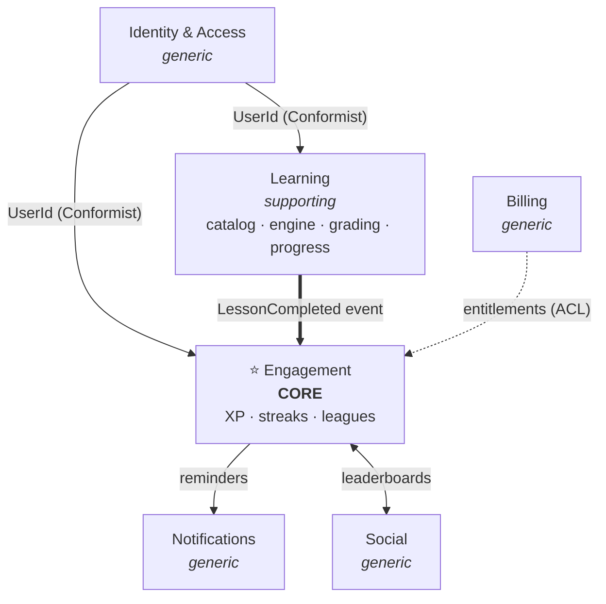

# Duolingo Clone — a System Design / DDD / Clean Architecture learning project

A Duolingo-style language-learning app (lessons, streaks, XP) built **to learn how to design
and build complex systems well** — using **strategic & tactical Domain-Driven Design**,
**Clean Architecture**, and an **evolutionary modular-monolith** approach. The product is the
vehicle; the real deliverable is the engineering practice.

> This repository documents not just *what* was built, but *why* — every significant decision
> is captured (with rejected alternatives) in [`docs/superpowers/specs`](docs/superpowers/specs).

## Objectives

- Practice **strategic DDD**: subdomains (core / supporting / generic), bounded contexts, a
  context map, and integration patterns.
- Practice **tactical DDD**: aggregates, value objects, domain events, invariants.
- Practice **Clean Architecture**: the Dependency Rule and Dependency Inversion, enforced by
  the compiler *and* by tests.
- Practice **system-design judgement**: where to invest modeling effort, how to keep module
  boundaries honest, and how to design for future scale without over-engineering today.
- Practice **disciplined delivery**: spec → plan → test-driven implementation, small commits.

## Tech stack

| Layer | Choice |
|---|---|
| Backend | C# / .NET 10, ASP.NET Core Minimal APIs |
| Frontend (planned) | Angular SPA |
| Persistence | EF Core 10 · SQL Server LocalDB |
| Tests | xUnit · NetArchTest |
| Messaging | Hand-rolled in-process mediator (CQRS-lite) |

## Architecture at a glance

An **evolutionary modular monolith**: one deployable today, but every module boundary is
designed so it *could* become a service later. The **Engagement** context is the **core
domain** (the habit-forming loop — XP, streaks, leagues); everything else is supporting or
generic.



Each module is internally layered (Clean Architecture); the **Domain depends on nothing**
infrastructural. Full reasoning in
[`docs/superpowers/specs/2026-05-28-architecture-foundations-design.md`](docs/superpowers/specs/2026-05-28-architecture-foundations-design.md).

## Project structure

```
src/
  Host/                              composition root + Minimal API
  BuildingBlocks/{Domain,Mediator,Contracts}
  Modules/Engagement/{Engagement.Domain, .Application, .Infrastructure}
  Modules/Learning/Learning.Stub
tests/
  Engagement.Domain.Tests            pure domain unit tests
  Engagement.Integration.Tests       mediator · application · persistence · e2e · architecture
docs/
  superpowers/specs/                 design specs + archived diagrams
  superpowers/plans/                 implementation plans
  design/building-blocks/            explainers (e.g. the hand-rolled mediator)
```

## Getting started

### Prerequisites

- **.NET 10 SDK** (`dotnet --version` → 10.x)
- **SQL Server LocalDB** (`MSSQLLocalDB`) — ships with Visual Studio / SQL Server Express.
  It starts on demand; nothing to run manually.
- **EF Core CLI** (for migrations): `dotnet tool install --global dotnet-ef`

### Build & test

```powershell
dotnet build
dotnet test          # 30 tests: 15 domain unit + 15 integration (incl. end-to-end on LocalDB)
```

The integration tests create and migrate their own databases automatically, then clean up.

### The two endpoints (slice 1)

| Method | Route | Purpose |
|---|---|---|
| `POST` | `/lessons/{lessonId}/complete` | Complete a (stubbed) lesson → awards XP |
| `GET`  | `/me/engagement` | Read the current learner's total XP |

The current user is faked via an `X-Learner-Id` header (real auth arrives with the Identity
module). See `CLAUDE.md` for a note on running the Host against a dev database.

## Documentation

- **Design foundations** (strategic DDD, architecture, build order): [`docs/superpowers/specs/2026-05-28-architecture-foundations-design.md`](docs/superpowers/specs/2026-05-28-architecture-foundations-design.md)
- **Sub-project 1 spec** (the XP skeleton): [`docs/superpowers/specs/2026-05-28-engagement-xp-skeleton-design.md`](docs/superpowers/specs/2026-05-28-engagement-xp-skeleton-design.md)
- **Implementation plan** (13 TDD tasks): [`docs/superpowers/plans/2026-05-28-engagement-xp-skeleton.md`](docs/superpowers/plans/2026-05-28-engagement-xp-skeleton.md)
- **How the mediator works:** [`docs/design/building-blocks/mediator.md`](docs/design/building-blocks/mediator.md)

## Status & roadmap

- ✅ **Sub-project 1 — Engagement XP walking skeleton:** earn + read XP end-to-end, 30 tests green.
- ⏭️ **Grow the core:** streaks (daily goal, streak freeze, timezones) → leagues (promotion/relegation).
- ⏭️ **Real Learning engine:** replace the stub with the actual exercise/grading model.
- ⏭️ **Real Identity:** replace the faked current user with authentication.

Each step follows its own **brainstorm → spec → plan → TDD** cycle on a dedicated branch.
