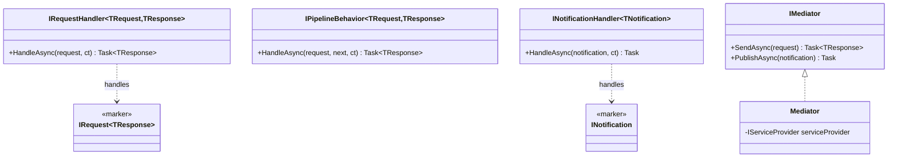
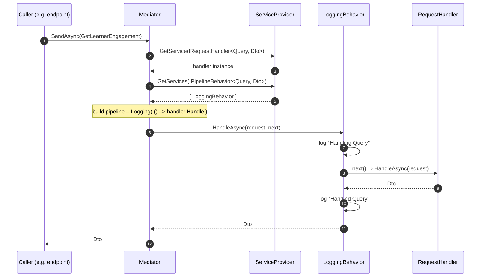
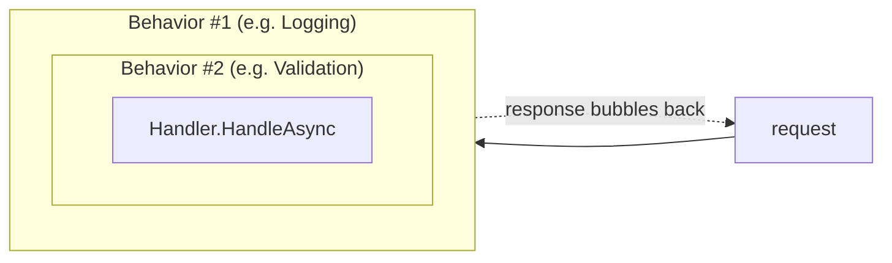
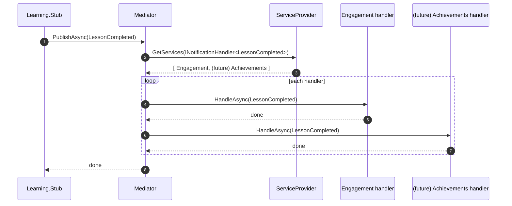
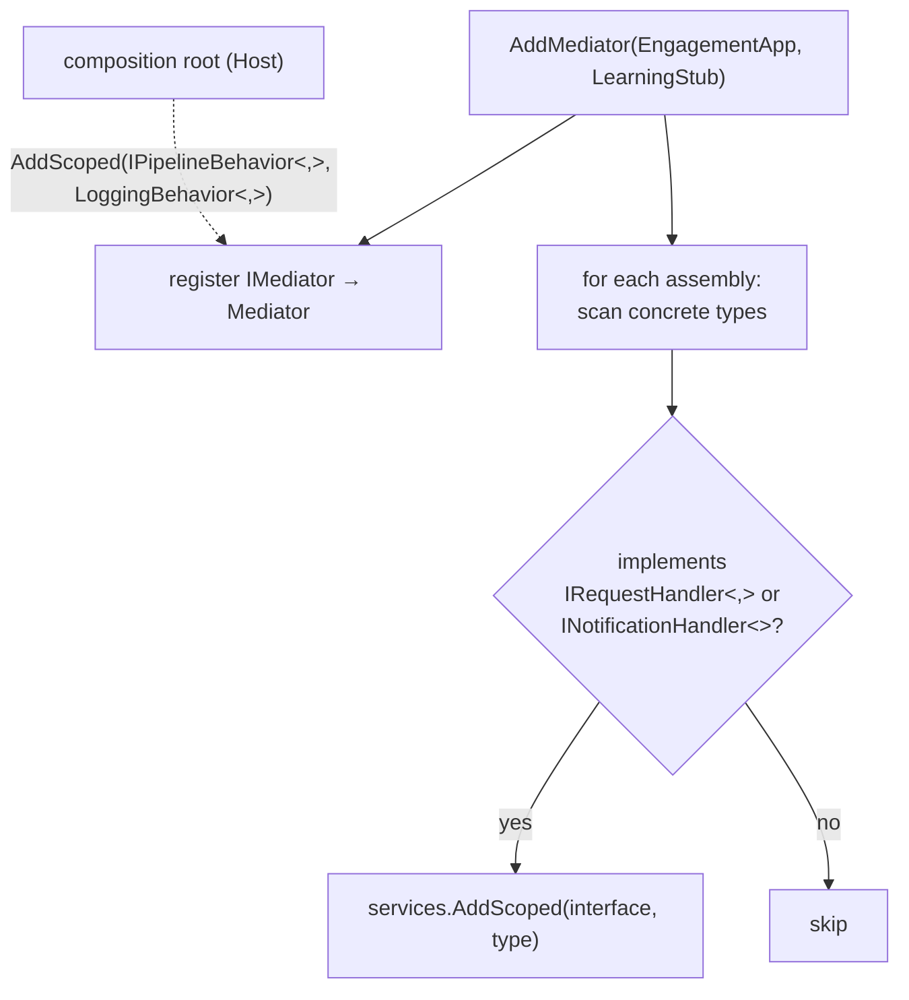

# Building Block: the hand-rolled Mediator

**Where:** `src/BuildingBlocks/Mediator/`
**Why it exists:** CQRS-lite. Every use case is an explicit *message* + *handler*, decoupling the caller (an API endpoint) from the code that does the work. We hand-rolled it (~80 lines) so there is no "magic" — it's just resolving handlers from the DI container and threading pipeline behaviors around them.

There are **two** flows: **Send** (one request → one handler → one response) and **Publish** (one notification → many handlers → no response).

---

## The pieces



- `IRequest<TResponse>` / `INotification` are **marker interfaces** — they carry no methods, they just tag a message so the compiler and the dispatcher know its kind and (for requests) its response type.
- Handlers are resolved from DI; the `Mediator` never news them up.

---

## Flow 1 — `SendAsync` (request → handler, wrapped by behaviors)

This is the important one. A request flows *down* through each pipeline behavior to the handler, and the result flows *back up* — like an onion. With one behavior (`LoggingBehavior`):



### Why behaviors form an "onion"

In `Mediator.SendAsync`, we start with a delegate that calls the handler, then **wrap** it with each behavior (iterating the list reversed, so the first registered behavior ends up outermost):



Each behavior receives a `next` delegate. It can run code **before** calling `next()` (e.g. start a stopwatch, validate, open a transaction), call `next()` to descend, then run code **after** (e.g. log, commit). This is the decorator pattern, built by folding the list:

```text
pipeline      = () => handler.HandleAsync(request)        // innermost
pipeline      = () => behaviorN.HandleAsync(request, pipeline)
...
pipeline      = () => behavior1.HandleAsync(request, pipeline)   // outermost
return pipeline()                                          // kick it off
```

---

## Flow 2 — `PublishAsync` (notification → all handlers)

A notification has **no response** and **zero-to-many** handlers. The mediator resolves every `INotificationHandler<T>` and invokes each. This is the central seam: `Learning` publishes `LessonCompleted`; it does not know that `Engagement` (and later Notifications, Achievements...) are listening.



> In slice 1 there is exactly one subscriber (Engagement). The point of choreography is that adding a second subscriber later requires **no change** to the publisher or the mediator — you just register another handler.

---

## How handlers get registered (`AddMediator`)

`AddMediator(params Assembly[])` scans the given assemblies, finds every concrete type implementing `IRequestHandler<,>` or `INotificationHandler<>`, and registers it in DI against that interface. Pipeline behaviors are registered separately (they're open generics) in the composition root.



At runtime, `Mediator` asks the `IServiceProvider` for the handler matching the message's runtime type (via `MakeGenericType`), then invokes it with `dynamic` so the correctly-typed `HandleAsync` overload is bound without manual reflection.

---

## Trade-offs we accepted

| Choice | Benefit | Cost |
|---|---|---|
| `dynamic` dispatch | Readable ~80-line dispatcher, no `MethodInfo.Invoke` | Missing-handler errors surface at **runtime**, not compile time |
| Marker interfaces | Compiler knows message kind + response type | A little ceremony per message |
| Assembly scanning | Handlers auto-register; no manual wiring | Reflection cost at startup (negligible) |

The missing-handler risk is mitigated by the integration and architecture tests, which exercise every real handler path.

---

*Related code:* `Mediator.cs`, `Abstractions.cs`, `IMediator.cs`, `MediatorServiceCollectionExtensions.cs`.
*Built in:* Task 4 of `docs/superpowers/plans/2026-05-28-engagement-xp-skeleton.md`.
