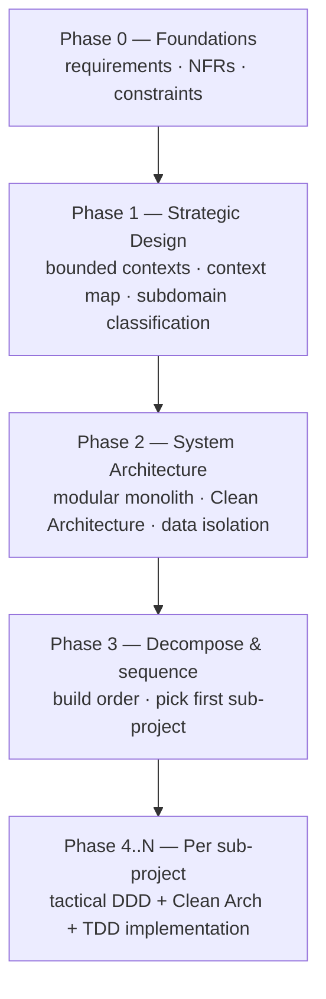
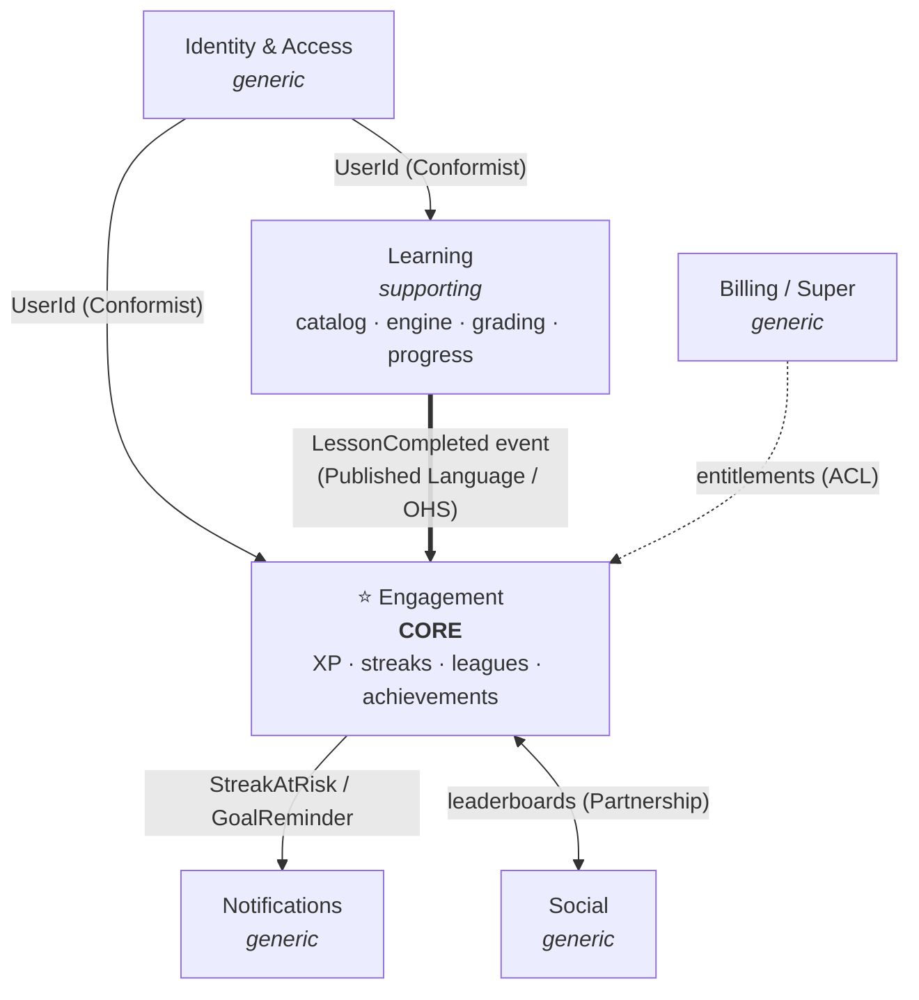
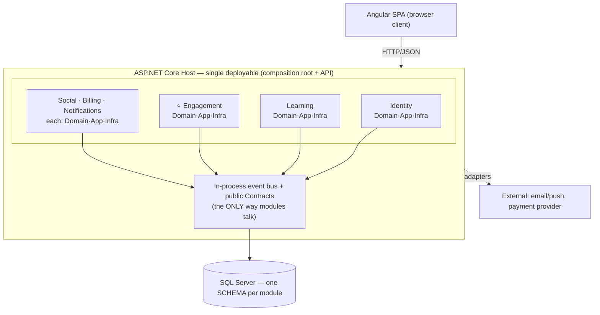
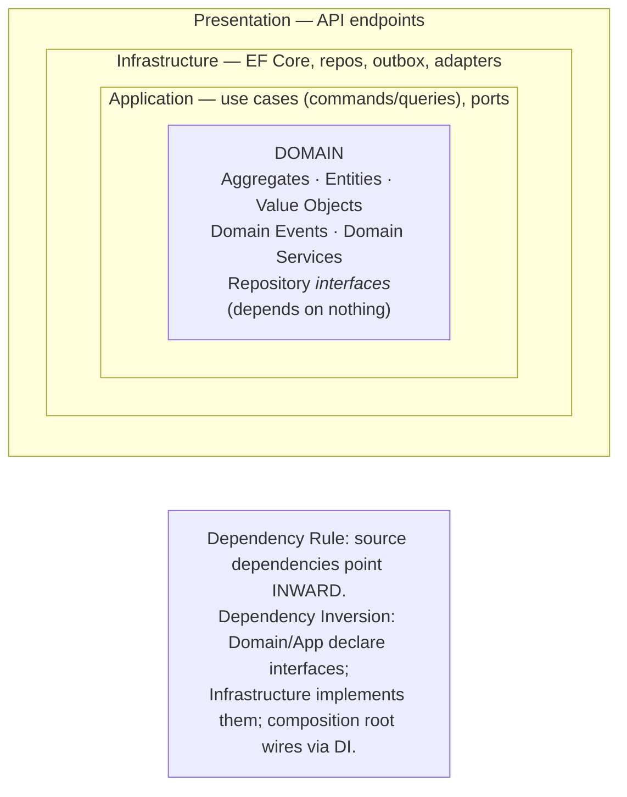
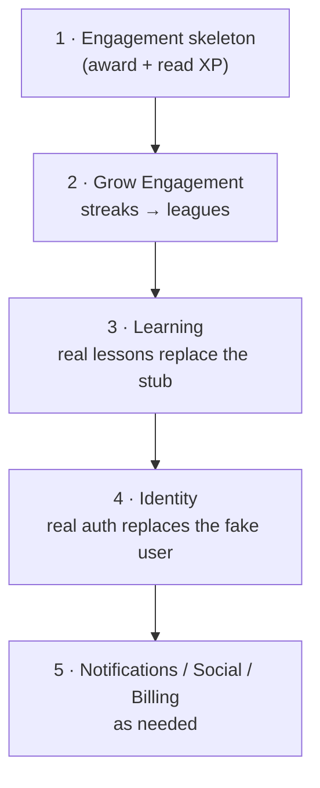

# Duolingo Clone — Architecture Foundations

**Date:** 2026-05-28
**Status:** Approved (design)
**Purpose:** The shared strategic & architectural foundation for the whole project.
Every sub-project design (see the per-sub-project specs) builds on the decisions here.

> This is a **learning project**: a Duolingo-style language-learning app (lessons,
> streaks, XP) built to practice **system design, Domain-Driven Design (DDD), and
> Clean Architecture**. Decisions are documented with their *reasoning and rejected
> alternatives*, because the "why" is the point.

Original interactive diagrams are archived under [`./diagrams/`](./diagrams/).

---

## The learning path

---

## Phase 0 — Requirements & constraints

### What we're building
A Duolingo-like system. The **north-star vision** (what we *model*) is broad; the
**first slice** (what we *implement* first) is deliberately tiny. We design for the
vision and build incrementally — never conflating the two.

### Decisions locked

| Decision | Choice | Why |
|---|---|---|
| Backend stack | **C# / ASP.NET Core Web API** | Mature, idiomatic home for DDD + Clean Architecture. Fits the user's environment. |
| Frontend | **Angular SPA** (explicitly **not** Razor) | Clean client/server separation; the API becomes a true bounded interface; the SPA is just one client. |
| Scale ambition | **Evolutionary modular monolith** | Build one deployable now, but design every boundary so it *could* be extracted into a service later. Learn scale *reasoning* without distributed-systems overhead, and still ship. |
| Database | **SQL Server**, **one schema per module** | Real logical isolation (no cross-schema JOINs), cheap to run, honest extraction path. |
| ORM | **EF Core** | Standard .NET data access. |
| App-layer style | **CQRS-lite** via a **hand-rolled mediator** | Most instructive: explicit use cases, small handlers, pipeline behaviors for cross-cutting concerns — without depending on a commercial library. |

### Non-functional posture
Single region, single deployable, pragmatic user scale. We **reason** about scale at
every boundary and document the playbook, but we do not pre-build distributed infra.

---

## Phase 1 — Strategic Design

### Subdomain classification

The most important strategic call: **what is the core?** You can have only one (maybe
two). Everything-is-core means nothing is.

- **Core** — your differentiator. Invest your richest modeling here.
- **Supporting** — necessary, business-specific, but not where you win. Keep it clean & simple.
- **Generic** — solved problems (auth, payments, notifications). **Integrate, don't hand-craft.**

**Decision:** the **Engagement / Habit loop is the core.** Duolingo's real moat is
habit formation (streaks, XP, leagues, daily goals), not the (largely commoditized)
lesson content. It's also the richest domain to model — a great DDD playground.

| Classification | Subdomains |
|---|---|
| **Core** | **Engagement** — XP, streaks, leagues, daily goals, achievements |
| **Supporting** | **Learning** — course catalog, skill tree, exercise engine, grading, **progress/mastery**, authoring |
| **Generic** | Identity & Access, Notifications, Payments/Billing, Social graph |

> Consequence: Engagement gets our most expressive domain model. The Learning engine is
> built cleanly but **deliberately not gold-plated**. Resisting the urge to over-model a
> supporting domain is itself a discipline.

### Subdomain vs. bounded context
A **subdomain** lives in the *problem space*; a **bounded context** lives in the
*solution space* — a boundary inside which one model and one **ubiquitous language** are
consistent. The word "lesson" may mean different things across contexts, and the
boundary is what protects each model.

We deliberately keep **few** contexts. Each boundary is a contract you must maintain;
context proliferation is a common beginner mistake. Notably, **Progress/Mastery is
folded into Learning** (shared language, progress is derived from learning activity) —
extractable later if spaced-repetition logic grows.

### Context map

**Integration patterns used:**
- **Published Language + Open Host Service** — Learning publishes a well-defined
  `LessonCompleted`; it does not know who listens. *This is the central seam.*
- **Conformist** — every context accepts Identity's `UserId` as-is.
- **Anti-Corruption Layer (ACL)** — contexts translate Billing's entitlement model into
  their own terms, shielding their models.
- **Partnership** — Engagement & Social co-evolve leaderboards.
- **Shared Kernel (deliberately avoided)** — we do *not* share a "User" model everywhere;
  that would couple the contexts.

### The central seam: how Learning talks to Engagement

"Publish an event" bundles three *separable* decisions: **coupling direction**,
**coordination style** (orchestration vs choreography), and **consistency** (atomic vs
eventual).

**Decision: staged choreography (events).**
1. **Now:** Learning raises an **in-process domain event** handled by Engagement
   **inside the same transaction** → decoupled *and* atomically consistent.
2. **Later (if extracted):** swap in-process dispatch for an **outbox → message broker**.
   Engagement becomes eventually consistent; we add observability then.

Rejected **orchestration** (a use-case calls each context directly): it centralizes
knowledge of every reactor in one place, and lesson-completion has *many* reactors
(Progress, Achievements, Notifications, Analytics). Choreography lets each subscribe
without editing a central orchestrator.

> Key insight: in a monolith, "event" ≠ "async broker." In-process domain events are
> both decoupled and transactional. Eventual consistency is a *later* cost, paid only
> when we extract a service.

---

## Phase 2 — System Architecture

### Macro: the modular monolith

**A modular monolith is a discipline, not a folder layout.** The rules that make it real:
- **No direct cross-module type references.** Learning cannot `new` an Engagement class.
  Modules see each other only through a thin **`Contracts`** assembly (events + DTOs) and
  the event bus.
- **Each module is internally layered** (Clean Architecture); its domain model is
  `internal` and never leaks.
- **No cross-schema JOINs.** Data isolation is what keeps "extractable later" honest.

Break these and you get a distributed monolith's coupling with a monolith's deployment —
the worst of both.

### Micro: Clean Architecture inside a module

| Layer | What lives here | Depends on |
|---|---|---|
| **Domain** | Aggregates, Entities, Value Objects, Domain Events, Domain Services, repository **interfaces**, invariants | nothing |
| **Application** | Use cases (commands/queries + handlers), DTOs, port interfaces (e.g. `IEmailSender`), unit-of-work orchestration, integration-event publishing | Domain |
| **Infrastructure** | EF Core `DbContext` + mappings + migrations, repository **implementations**, outbox, external adapters | Application + Domain |
| **Presentation** | API endpoints, request/response models, auth wiring, mapping to commands/queries | Application |

> The crucial move: the Domain *owns* the repository **interface**; Infrastructure
> provides the EF Core **implementation**; the composition root injects it. That
> inversion is *why* the domain never imports `DbContext` and stays pure and testable.

**Application-layer style:** CQRS-lite. Each use case is a `Command`/`Query` message +
`Handler`. Cross-cutting concerns (validation, logging, transaction-per-request, outbox
dispatch) compose as **pipeline behaviors**. We **hand-roll** the ~30-line mediator to
demystify it and avoid a commercial dependency.

---

## Phase 3 — Build order

**Principle: build the core first, behind a thin vertical slice (a "walking
skeleton").** The core is the riskiest, most valuable, most uncertain part — validate
the model *and* the whole architecture early, not after weeks of generic plumbing.

A **walking skeleton** is the thinnest end-to-end slice exercising every layer. A
**vertical** slice (thin, full-depth) de-risks integration; a **horizontal** slice (one
whole layer) defers integration pain to the worst moment.

We always keep a **running, demoable system**. Early scaffolding (a stubbed
`LessonCompleted` trigger, a faked current user) is replaced in later steps.

**First sub-project:** the **Engagement XP walking skeleton** — see
[`2026-05-28-engagement-xp-skeleton-design.md`](./2026-05-28-engagement-xp-skeleton-design.md).
