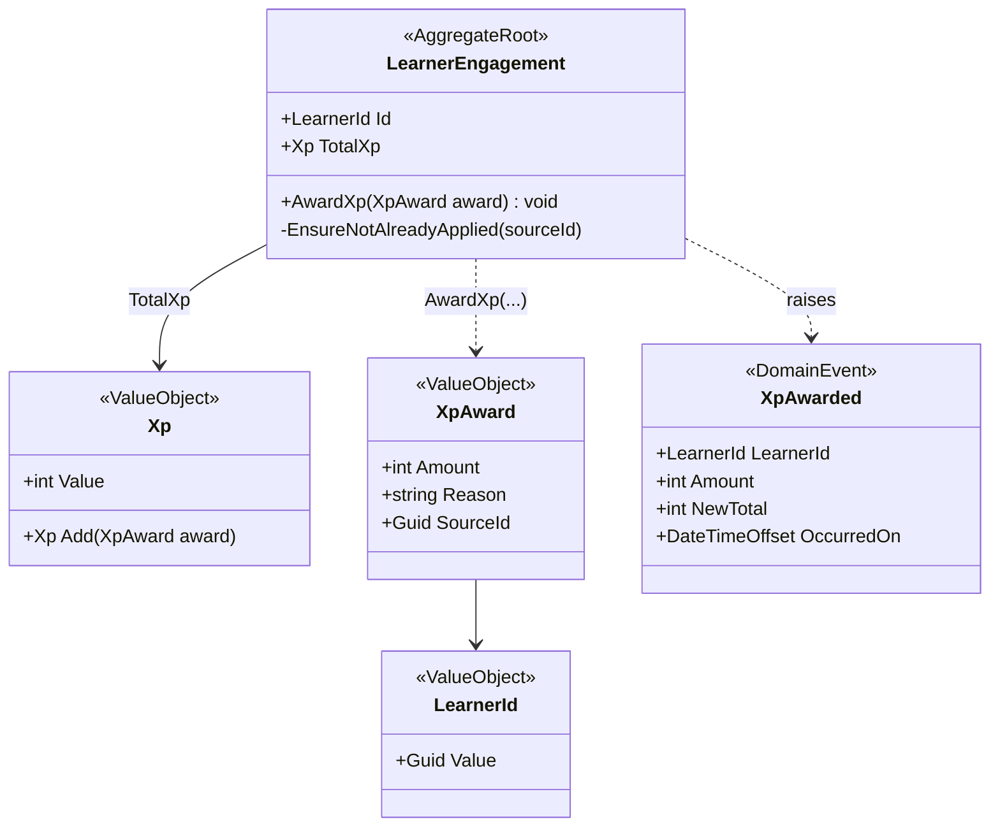
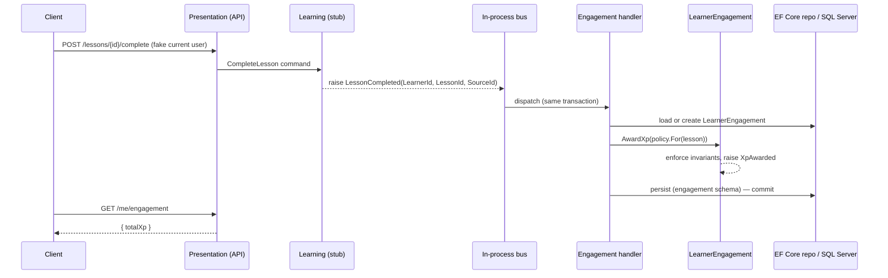
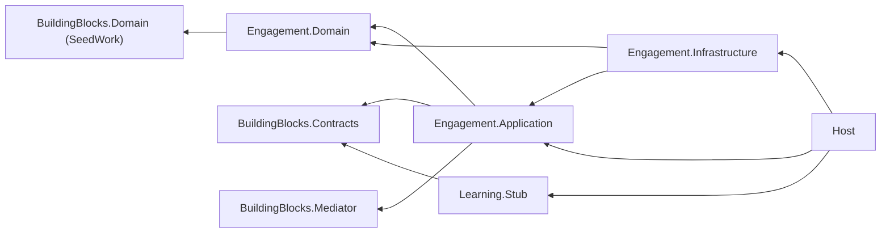

# Sub-project 1 — Engagement XP Walking Skeleton

**Date:** 2026-05-28
**Status:** Approved (design)
**Builds on:** [`2026-05-28-architecture-foundations-design.md`](./2026-05-28-architecture-foundations-design.md)

## Goal

The **thinnest end-to-end slice** through the entire architecture, built around the
**core (Engagement)**: *a learner earns XP when a lesson is completed, and can read
their XP total.* Its job is to **validate the architecture** (modular monolith wiring,
Clean Architecture layers, in-process event bus, EF Core on SQL Server, DI, the
hand-rolled mediator) and to **model the core** properly — not to be feature-complete.

## Scope

### In scope
- `Engagement` module with full Clean Architecture layering.
- `LearnerEngagement` aggregate that awards and totals XP, with invariants.
- A `LessonCompleted` domain event published by a **stub** Learning module.
- In-process, single-transaction event dispatch (the hand-rolled mediator + a pipeline
  behavior that opens a transaction/unit-of-work).
- Persistence to SQL Server in the `engagement` schema via EF Core.
- Two API endpoints (command + query).

### Explicitly OUT of scope (deferred, by design)
- Streaks, leagues, achievements, daily goals (next sub-projects).
- Real Learning engine (we stub the trigger).
- Real Identity/auth (current user is **faked** — a fixed/he­ader-provided `LearnerId`).
- Outbox / async messaging (the seam is in-process now; outbox comes at extraction time).
- Angular frontend (API-first; the SPA is a later client).

## Tactical model



**Design rules captured:**
- **Aggregate = consistency boundary.** `AwardXp(...)` is the *only* mutator; there is
  **no public setter** on `TotalXp`. Invariants live inside the aggregate.
- **Value objects kill primitive obsession.** `Xp` cannot be negative; `LearnerId` cannot
  be confused with any other `Guid`. Illegal states are unrepresentable.
- **Idempotency from day one.** `AwardXp` is idempotent per `XpAward.SourceId` (the
  `LessonCompleted` event id). In-process delivery is reliable today, but the outbox path
  will allow at-least-once delivery later — designing for it now is cheap.
- **XP policy lives in Engagement**, not Learning. Learning only announces a lesson was
  completed. For the skeleton, a trivial flat policy (e.g. 10 XP). The *seam* matters,
  not the number.

### Invariants
- `XpAward.Amount > 0`.
- `TotalXp` never negative; guard against overflow.
- At most one award per `SourceId` (idempotent).

## Request flow (the walking skeleton)



## Proposed solution structure

**Boundary enforcement = compiler-first (project per layer, per module).** Each layer of
a real module is its own `.csproj` assembly. The Dependency Rule is enforced by **project
references + `internal` access + simply not referencing the wrong NuGet packages** — so
illegal dependencies are *impossible*, not merely discouraged. The disposable
`Learning.Stub` stays a single project (it graduates to full layering when the real
Learning module is built). `NetArchTest`-based architecture tests are added later as a
belt-and-suspenders for rules the compiler can't express.

```
src/
  Host/                              # .csproj — ASP.NET Core composition root + endpoints
  BuildingBlocks/
    Contracts/                       # .csproj — cross-module events & DTOs (LessonCompleted lives here)
    Mediator/                        # .csproj — hand-rolled mediator + pipeline behaviors
    Domain/                          # .csproj — SeedWork: AggregateRoot, ValueObject, IDomainEvent
  Modules/
    Engagement/
      Engagement.Domain/             # .csproj — LearnerEngagement, Xp, XpAward, LearnerId, XpAwarded,
                                     #           ILearnerEngagementRepository.  NO EF/ASP packages.
      Engagement.Application/        # .csproj — AwardXpForLessonCompleted handler, GetEngagement query
      Engagement.Infrastructure/     # .csproj — EF Core DbContext (engagement schema), repo impl, migrations
    Learning/
      Learning.Stub/                 # .csproj (single project) — CompleteLesson command → raises LessonCompleted
tests/
  Engagement.Domain.Tests/           # .csproj — aggregate invariants (TDD here first)
  Engagement.Integration.Tests/      # .csproj — end-to-end slice against SQL Server
```

**Project reference directions (the Dependency Rule, made physical):**



> `Engagement.Domain` references only `BuildingBlocks.Domain` — no EF Core, no ASP.NET,
> no other module. That single fact is acceptance criterion #5, and now it is enforced
> structurally rather than by good intentions.

## Acceptance criteria
1. `POST /lessons/{id}/complete` for a learner with 0 XP results in `TotalXp == 10`.
2. `GET /me/engagement` returns the learner's current `TotalXp`.
3. Delivering the **same** `LessonCompleted` (same `SourceId`) twice awards XP **once**
   (idempotency proven by test).
4. `AwardXp` with amount ≤ 0 is rejected by the domain (unit test).
5. The Engagement domain project references **no** EF Core / ASP.NET packages (Clean
   Architecture dependency rule enforced — verifiable by project references).
6. No cross-module type reference between Learning.Stub and Engagement except via
   `Contracts` (modular-monolith rule).

## Testing approach (TDD)
- **Domain-first, red-green-refactor.** Write `Engagement.Domain.Tests` for `AwardXp`
  invariants and idempotency *before* the implementation.
- **Integration test** drives the full slice (command → event → persist → query) against
  a real SQL Server (LocalDB or container).

## Open implementation choices (resolve during planning)
- Exact shape of the hand-rolled mediator + the transaction pipeline behavior.
- LocalDB vs SQL Server container for tests.
- Minimal API vs controllers for the two endpoints.
