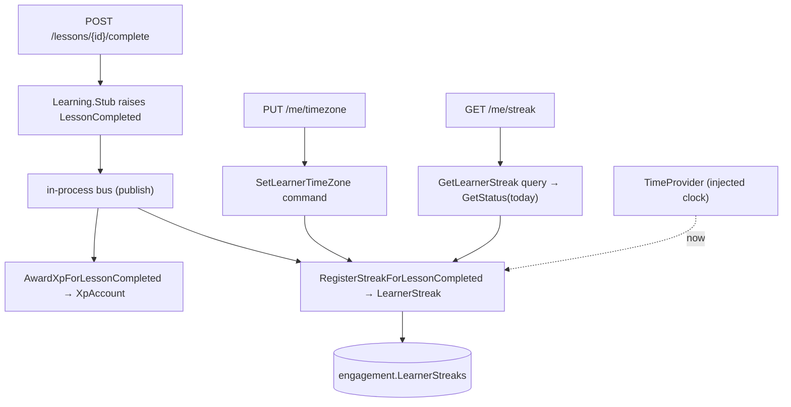
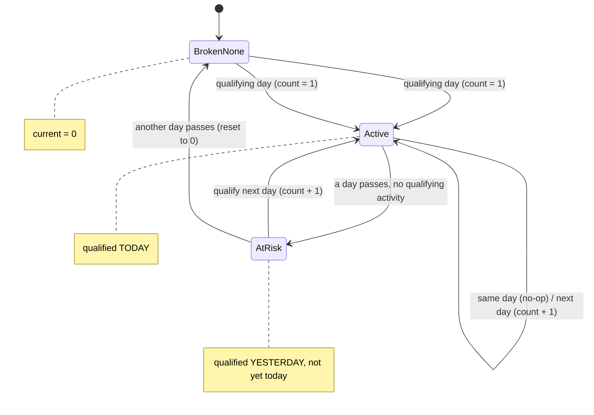
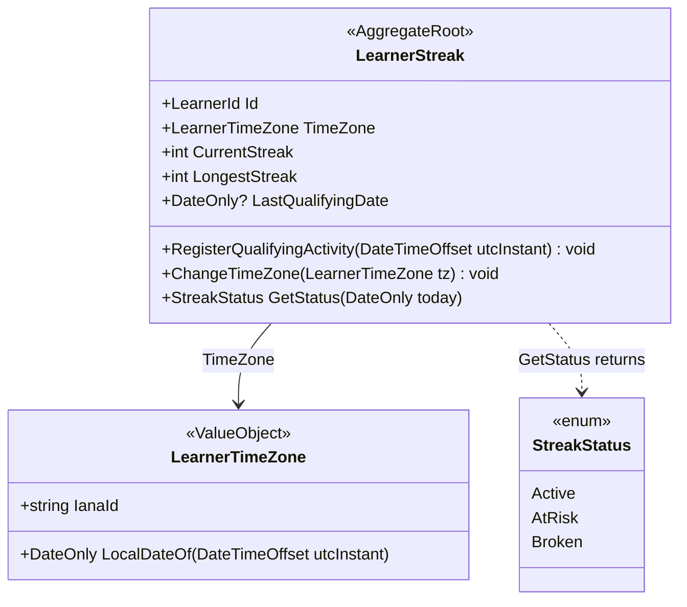

# Sub-project 2 — Streaks

**Date:** 2026-06-01
**Status:** Approved (design)
**Builds on:** Sub-project 1 (Engagement XP skeleton) and
[`2026-05-28-architecture-foundations-design.md`](./2026-05-28-architecture-foundations-design.md)

## Goal

Add **streaks** to the Engagement core: a learner who completes a lesson on consecutive
**local-time** days builds a streak; missing a day breaks it. Track current and longest
streak. This grows the core with genuinely rich domain logic (timezone-correct day
boundaries, a derived state machine) while reusing the `LessonCompleted` choreography seam.

Original interactive diagrams archived under [`./diagrams/`](./diagrams/) (prefix `streaks-`).

## Scope

### In scope
- A new **`LearnerStreak`** aggregate in the Engagement context (separate from XP).
- Streak advances on **any** completed lesson (the "qualifying day" notion is kept abstract
  so a future daily-goal rule can swap in without touching the streak core).
- **Local-time** day boundaries, using a learner time zone **replicated** into Engagement.
- **Derived** streak state (no scheduled/nightly job): store `count` + `lastQualifyingDate`;
  compute Active/AtRisk/Broken on read relative to "today".
- Track **current + longest** streak.
- A `SetLearnerTimeZone` command, a `GetLearnerStreak` query, and two endpoints.
- **Rename** the slice-1 XP aggregate `LearnerEngagement` → `XpAccount` (and its table).

### Out of scope (deferred, by design)
- **Streak freeze** (inventory, earning/buying, auto-apply). The transition's gap case is the
  designed extension point; freeze becomes its own sub-project.
- Daily-goal definition of "qualifying" (kept swappable, not built).
- Real Identity (time zone is set via command now; a `LearnerTimeZoneChanged` event replaces
  the setter when Identity exists).

## Data flow

Two **independent subscribers** to one event — no orchestrator. This is the choreography
seam from sub-project 1 paying off: adding streak required *zero* changes to XP or to the
publisher.

## Why local time matters (the timezone trap)

For a learner in New York (UTC−05):

| Two lessons | Local-date interpretation | UTC-date interpretation |
|---|---|---|
| Mon 11:30 PM local (= Tue 04:30 UTC), then Wed 7:00 AM local | Mon, Wed → **Tue missed → reset (correct)** | Tue, Wed → **looks consecutive → keeps streak (WRONG)** |

UTC boundaries silently award streaks the learner didn't earn. Correct streaks require the
learner's **local** day boundary — hence the replicated time zone.

## The streak state machine

**Active / AtRisk / Broken are *derived on read*, not stored.** The aggregate stores only
`CurrentStreak`, `LongestStreak`, and `LastQualifyingDate`. A missed day needs no action —
the gap reveals itself next time the streak is observed. **No nightly job, no per-user
timers.**

### Transition function — on a qualifying day, local date `D` (given `count`, `lastDate`)

| Condition | Effect |
|---|---|
| `lastDate is null` or `D > lastDate + 1` (gap) | `count = 1; lastDate = D` (start / reset). **Freeze plugs in here later.** |
| `D == lastDate + 1` | `count += 1; lastDate = D` (continue) |
| `D == lastDate` | no-op — already counted today (**idempotent**) |
| `D < lastDate` | ignore (late / out-of-order event) |

After any change: `LongestStreak = max(LongestStreak, CurrentStreak)`.

### Derived read — `GetStatus(today)`

| Relationship | Status | Effective current |
|---|---|---|
| `lastDate == today` | Active | `CurrentStreak` |
| `lastDate == today − 1` | AtRisk | `CurrentStreak` |
| `lastDate < today − 1` or null | Broken / None | `0` |

> Teaching point: **stored vs displayed**. The stored `CurrentStreak` lingers at its last
> value after a miss; the *displayed* current is `0` until the next qualifying day resets it.

## Idempotency — a deliberate contrast with XP

XP dedups per `SourceId` via the `AppliedAward` ledger. Streak needs **no ledger**: the
`D == lastDate` no-op means multiple lessons in one day (or a re-delivered `LessonCompleted`
on the same local day) naturally count once. **Idempotency strategy follows the domain's
invariant** ("one advance per local day"), not a template.

## Tactical model

- **`LearnerTimeZone`** is a value object wrapping a validated IANA id (e.g.
  `America/New_York`); construction throws on an invalid id (via
  `TimeZoneInfo.FindSystemTimeZoneById`). It owns the UTC→local-date conversion
  (`LocalDateOf`) — Tell, Don't Ask: the streak never does timezone math itself.
- **`LearnerId`** is reused from the Engagement domain (already exists).
- Default time zone is **UTC** until set.
- Domain events (`StreakAdvanced` / `StreakReset`) may be raised for the pattern, but have no
  subscribers in this slice (same YAGNI stance as `XpAwarded`) and are cleared on save.

## Time handling & testability

- Inject .NET's built-in **`TimeProvider`** (registered `TimeProvider.System`); never call
  `DateTime.UtcNow` directly. The handler and query derive "today" from it.
- Tests use `FakeTimeProvider` to pin "now" and walk a learner across days deterministically.
- `DateOnly` maps to a SQL `date` column (EF Core 10).

## Components

### Application (`Engagement.Application`)
- `RegisterStreakForLessonCompletedHandler : INotificationHandler<LessonCompleted>` — the 2nd
  subscriber. Loads/creates `LearnerStreak`, calls `RegisterQualifyingActivity(OccurredOn)`,
  saves.
- `SetLearnerTimeZone(Guid LearnerId, string IanaId)` command + handler.
- `GetLearnerStreak(Guid LearnerId)` query + handler → `StreakDto(current, longest, status,
  lastQualifyingDate)`, computed against `TimeProvider`-derived local today.
- `ILearnerStreakRepository` (in `Engagement.Domain`).

### Infrastructure (`Engagement.Infrastructure`)
- `LearnerStreak` EF config: table `engagement.LearnerStreaks`, key `LearnerId` (converter),
  `TimeZone` → IANA string column, `CurrentStreak`/`LongestStreak` ints,
  `LastQualifyingDate` nullable `date`.
- `LearnerStreakRepository`.
- Migration `AddLearnerStreak`.
- Register `TimeProvider.System`.

### Host
- `PUT /me/timezone` (body `{ "ianaId": "America/New_York" }`) → `SetLearnerTimeZone`.
- `GET /me/streak` → `GetLearnerStreak`.

### Rename (first task)
`LearnerEngagement` → `XpAccount`: aggregate, EF config, repository, the XP handler, slice-1
tests, and a migration renaming `engagement.Learners` → `engagement.XpAccounts`. Done first so
the rest builds on clean names.

## Error handling
- Invalid IANA id → `LearnerTimeZone` throws → endpoint returns **400**.
- `GET /me/streak` for an unknown learner → **200** with a zeroed "no streak" status
  (current 0, longest 0, status Broken/None).

## Testing

**Domain (`Engagement.Domain.Tests`):**
- Transition: start, continue (count+1), same-day no-op, gap → reset, late event ignored.
- Longest updates when current exceeds it; longest survives a reset.
- **Timezone**: the near-midnight New York case yields the correct local dates.
- `GetStatus` derivation: Active / AtRisk / Broken (incl. the stored-vs-displayed gap).
- `LearnerTimeZone` rejects an invalid IANA id.

**Integration (`Engagement.Integration.Tests`):**
- Persistence round-trip (`DateOnly` + time zone).
- End-to-end with an overridden `FakeTimeProvider`: set time zone, complete lessons across
  consecutive days → streak grows; skip a day → resets; `GET /me/streak` reflects each step.

## Acceptance criteria
1. Completing a lesson on day N then day N+1 (learner-local) yields `current == 2`.
2. Skipping a day resets `current` to `1` on the next completion; `longest` retains the peak.
3. Two completions on the same local day leave `current` unchanged (idempotent).
4. A lesson at 11:30 PM local and the next at 7:00 AM two local days later is treated as a gap
   (timezone-correct), not consecutive.
5. `GET /me/streak` returns Active today, AtRisk if last activity was yesterday, Broken if
   older — derived, with no scheduled job involved.
6. Setting an invalid IANA time zone returns 400.
7. The XP aggregate is `XpAccount`; all slice-1 tests still pass after the rename.
