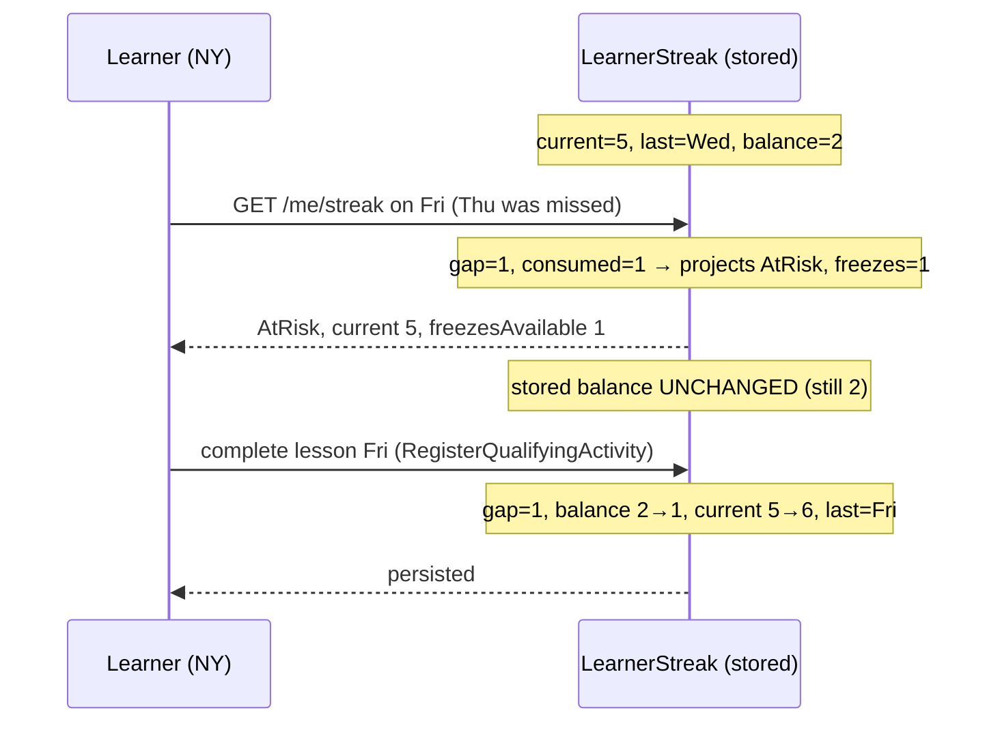
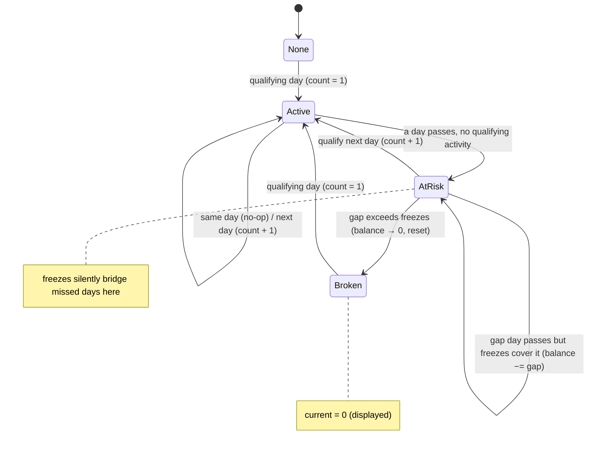
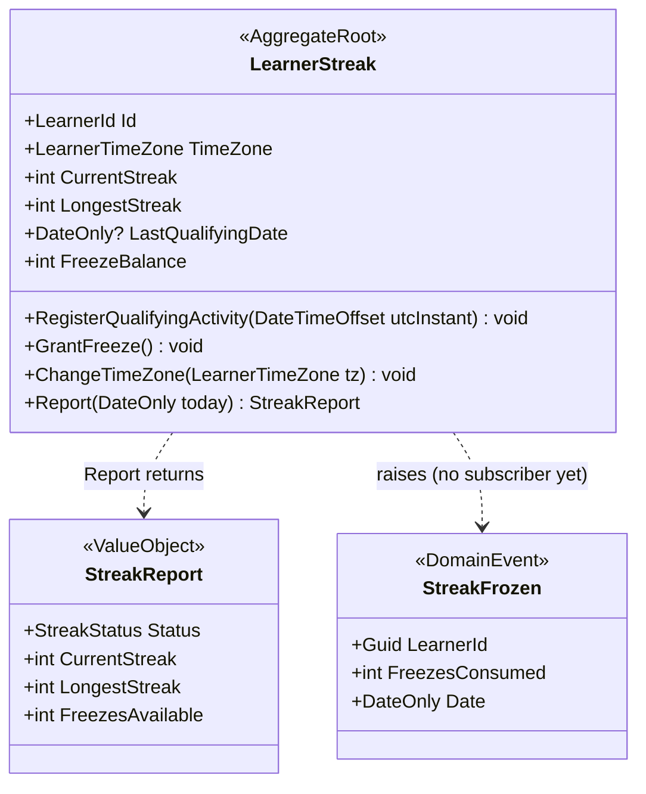
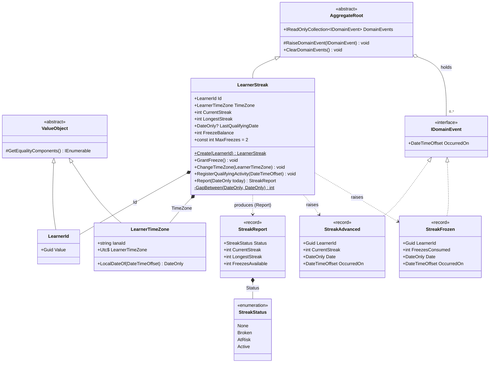
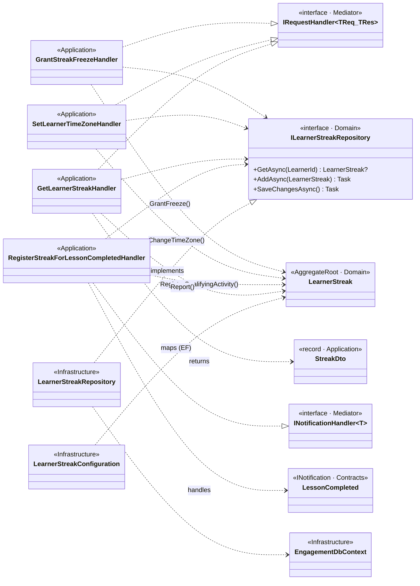

# Sub-project 3 — Streak Freeze

**Date:** 2026-06-09
**Status:** Approved (design)
**Builds on:** Sub-project 2 (Streaks) — [`2026-06-01-streaks-design.md`](./2026-06-01-streaks-design.md)

## Goal

Let a learner **protect a streak** from a missed day by spending a **streak freeze**. A freeze is
an item held in a small, capped inventory; it is **auto-applied** the instant a gap is detected,
preserving the streak without the learner doing anything. This plugs directly into the extension
point the streaks design reserved: the **gap branch** of `RegisterQualifyingActivity`
(`LearnerStreak.cs`, the `: 1` reset).

The freeze feature must honour the two commitments streaks made: **state stays derived** (no
nightly job, no per-user timers) and **idempotency is a domain rule**, not an infra trick.

Original brainstorming visuals archived under [`./diagrams/`](./diagrams/) (prefix `streak-freeze-`).

## The behaviour (settled in brainstorming)

Classic Duolingo-style freeze:

- **Auto-applied** — no learner action; the system spends a freeze when a gap appears.
- A frozen day **preserves** the streak but does **not** increment it.
- Inventory is **capped** at **2** (a domain constant, easily tuned).
- Missing **more consecutive days than freezes held** still breaks the streak.
- **Lazily settled** — a freeze is only actually consumed by the next qualifying activity; reads
  *project* the outcome without mutating.

Acquisition is **out of scope** beyond an abstract grant (see below).

## Scope

### In scope
- Add `FreezeBalance` to the existing **`LearnerStreak`** aggregate (one aggregate; see "Why one
  aggregate").
- Extend `RegisterQualifyingActivity` with gap-bridging and `Report` with freeze-aware projection,
  via **one shared gap helper** so write and read cannot drift.
- A `GrantFreeze()` domain operation (clamps at the cap) and a `GrantStreakFreeze` command + a
  `POST /me/streak-freezes` endpoint — an **abstract acquisition seam** standing in for a future
  economy, the way `Learning.Stub` stands in for the real Learning engine.
- Surface `freezesAvailable` (projected) on `GET /me/streak`.

### Out of scope (deferred, by design)
- **Earning / buying** freezes (gems, currency, milestone rewards). The `GrantStreakFreeze`
  command is the seam; a real economy becomes its own sub-project.
- **Per-freeze identity / expiry.** Inventory is a single capped integer, not typed items.
- **Manual apply.** Freezes apply automatically; no "spend a freeze" UI affordance.
- **Notifications** ("we saved your streak!"). A `StreakFrozen` domain event is raised for the
  pattern but has **no subscriber** yet (same YAGNI stance as `StreakAdvanced`).

## Why one aggregate (the consistency boundary)

Bridging a gap means "**decrement the balance and preserve the streak**" as a single atomic
change — you cannot legally do one without the other. By the DDD rule that *an aggregate is a
consistency boundary*, the freeze balance and the streak state belong in the **same aggregate**,
mutated in one transaction. A separate `StreakFreezeInventory` aggregate would force cross-aggregate
coordination (one transaction touching both, or eventual consistency via events) for no benefit at
this stage — rejected as YAGNI. A nightly settlement job was also rejected: it would abandon the
"derived on read, no nightly job" stance streaks deliberately took.

## The core model — one uniform rule

The entire feature collapses into a single rule applied **identically** on the write path and the
read projection:

```
gap      = whole days missed between lastDate and the reference date
consumed = min(gap, FreezeBalance)
streak survives  ⇔  consumed == gap
```

One freeze is burned per missed day, up to what is held. Cover the whole gap → the streak lives.
Run out partway → the remaining freezes burn and the streak still resets. **There is no separate
"partial gap" policy to decide — it falls out of the `min`**, and it is exactly the faithful
day-by-day Duolingo behaviour.

### Write — `RegisterQualifyingActivity(occurredOnUtc)`, local day `D`

| Condition | Effect |
|---|---|
| `lastDate is null` | `current = 1` |
| `D <= lastDate` | no-op — same day (idempotent) or late/out-of-order |
| `gap == 0` (`D == lastDate + 1`) | `current += 1` |
| `gap >= 1` and `balance >= gap` | `balance -= gap; current += 1` (**streak survives**) |
| `gap >= 1` and `balance < gap`  | `balance = 0; current = 1` (**all freezes burned, streak resets**) |

where `gap = (D - lastDate).Days - 1`. After any change: `lastDate = D`,
`LongestStreak = max(LongestStreak, CurrentStreak)`, raise `StreakAdvanced`; if `consumed > 0` and
the streak survived, also raise `StreakFrozen`. **Persisted.**

### Read — `Report(today)` — pure, no mutation

| Relationship | Status | Effective current | Effective freezes |
|---|---|---|---|
| `lastDate is null` | None | 0 | `balance` |
| `today == lastDate` | Active | `CurrentStreak` | `balance` |
| `gap == 0` (`lastDate == today − 1`) | AtRisk | `CurrentStreak` | `balance` |
| `gap >= 1` and `balance >= gap` | AtRisk | `CurrentStreak` | `balance − gap` |
| `gap >= 1` and `balance < gap`  | Broken | 0 | 0 |

where `gap = (today - lastDate).Days - 1`. Because the read uses the **same gap math** as the
write, *what the learner sees before studying is exactly what gets persisted when they do.*

## Lazy settlement — still derived, still no nightly job

Stored `FreezeBalance` is **only** decremented by a real qualifying activity. A read never
mutates — it projects `balance − consumed` against today.



If the learner never returns, each read recomputes against an ever-larger gap until it projects
**Broken**. Stored state stays put; the projection does the work. No scheduled process exists.

## The streak state machine (with freeze)



## Idempotency — preserved, for free

Consumption is bound to **advancing `lastDate`**. A re-delivered `LessonCompleted` for a day that
already bridged a gap arrives as `D == lastDate` → no-op → **the freeze is never double-consumed**.
This is the same "one advance per local day" invariant streaks already rely on, now extended to
inventory. Late/out-of-order events (`D < lastDate`) are ignored and cannot un-consume a freeze.

## Backward compatibility

With `FreezeBalance == 0`, every branch reduces to today's exact streak behaviour — the freeze
model is a strict **superset**. All existing streak tests must pass untouched; this is itself an
acceptance criterion.

## Tactical model



- **Cap** is a domain constant on `LearnerStreak` (`const int MaxFreezes = 2`). `GrantFreeze()`
  clamps: `FreezeBalance = Math.Min(FreezeBalance + 1, MaxFreezes)`.
- The **gap helper** (e.g. `private static int GapBefore(DateOnly from, DateOnly to)`) is the
  single source of the `(to - from).Days - 1` computation used by both methods.

## As-built class relationships

Captured from the implemented code (the helper shipped as `GapBetween`; events carry the
`IDomainEvent` `OccurredOn` member, matching the existing `StreakAdvanced`/`XpAwarded`
convention). Two views: the domain model, then the cross-layer wiring that shows the
Dependency Rule.

### Domain model



### Cross-layer wiring (handlers, repository port, EF adapter)



**What the relationships show.** `LearnerStreak` *is an* `AggregateRoot` and **composes** the
value objects `LearnerId` and `LearnerTimeZone`; it **produces** the `StreakReport` projection
and **raises** the `StreakAdvanced` / `StreakFrozen` domain events (collected by the base
`DomainEvents`). Every Application handler depends *inward* on `ILearnerStreakRepository` — an
interface owned by the **Domain** — while Infrastructure's `LearnerStreakRepository` *implements*
it and `LearnerStreakConfiguration` maps the aggregate. That dependency inversion keeps the
domain free of EF/ASP.NET: the arrows point inward, never out. The handlers stay thin (load →
one aggregate method → save); the behaviour lives in the aggregate.

## Components

### Domain (`Engagement.Domain`)
- **`LearnerStreak`** — add `FreezeBalance`; add the `gap >= 1` branch to
  `RegisterQualifyingActivity`; add the two freeze-aware rows to `Report`; add `GrantFreeze()`;
  extract the shared gap helper.
- **`StreakReport`** — add `int FreezesAvailable`.
- **`StreakFrozen`** — new `IDomainEvent`, raised when freezes are consumed on a surviving advance.
  No subscriber (pattern only).

### Application (`Engagement.Application`)
- **`GrantStreakFreeze(Guid LearnerId)`** command + handler — load-or-create the `LearnerStreak`,
  call `GrantFreeze()`, save. Mirrors `SetLearnerTimeZone`.
- **`StreakDto`** — add `int FreezesAvailable`; `GetLearnerStreakHandler` reads it off the report.
  The unknown-learner branch returns `FreezesAvailable: 0`.
- `RegisterStreakForLessonCompletedHandler` — **unchanged**; the new behaviour lives entirely in
  the aggregate (a payoff of keeping the rule in the domain).

### Infrastructure (`Engagement.Infrastructure`)
- `LearnerStreakConfiguration` — map `FreezeBalance` (int, non-null, default 0).
- Migration **`AddStreakFreeze`** — add the `FreezeBalance` column to `engagement.LearnerStreaks`.

### Host
- **`POST /me/streak-freezes`** → `GrantStreakFreeze` (returns **200**). The abstract acquisition
  seam.
- `GET /me/streak` response gains `freezesAvailable` — no new endpoint.

## Error handling

- **`POST /me/streak-freezes`** — no meaningful bad input; load-or-create, grant, **200**.
  Granting to an unknown learner creates the streak (balance 1).
- **Grant at cap** — `GrantFreeze()` clamps (balance stays 2); still **200**.
- **`GET /me/streak`** for an unknown learner — **200**, zeroed status, `freezesAvailable: 0`.
- **Lazy-settlement × cap (known, accepted).** Because stored balance is decremented only on
  activity, a grant clamps against *stored* inventory even if the projection shows fewer effective
  freezes. Cap is enforced on stored inventory; reconciling the projection into grants is
  unnecessary (YAGNI).
- **Timezone change mid-streak** can shift "today" and thus the projected gap. Pre-existing streak
  concern; the projection recomputes against the current zone, no special handling.

## Testing

**Domain (`Engagement.Domain.Tests`) — fast, pure:**
- Grant: `0 → 1`; clamp at cap (`2 → 2`).
- Gap 1 + 1 freeze → survives, `current += 1`, balance 0.
- Gap 1 + 0 freezes → resets to 1 (unchanged behaviour).
- Gap 2 + 2 freezes → survives, balance 0; Gap 2 + 1 freeze → resets, balance 0 (burned, still
  broke); Gap 3 + 2 freezes → resets, balance 0.
- **Frozen day does not increment** — assert exact count after a bridged gap.
- Longest survives both a freeze-bridge and a reset.
- Same-day no-op consumes no freeze; re-delivered bridge event does not double-consume.
- `Report` projection: covered gap → AtRisk with `FreezesAvailable == balance − gap` **and stored
  balance unchanged after `Report`** (proves the read is pure); exceeded gap → Broken.
- Timezone-correct gap (the New York near-midnight case) holds with a freeze in play.
- Backward-compat: `balance == 0` ⇒ identical to pre-freeze transitions.

**Integration (`Engagement.Integration.Tests`):**
- Persistence round-trip of `FreezeBalance`.
- End-to-end with `FakeTimeProvider`: `POST /me/streak-freezes` → complete day N → skip N+1 →
  complete N+2 → streak preserved, `freezesAvailable` decremented; then exhaust freezes → streak
  breaks. Grant-beyond-cap clamps.

## Acceptance criteria

1. A learner with **1 freeze** who misses exactly one day has the streak **preserved** (not reset);
   the next completion continues the count, and the freeze balance is 0.
2. A learner with **0 freezes** who misses a day **resets** on the next completion (unchanged from
   streaks).
3. A gap **longer than the freezes held** breaks the streak and consumes **all** freezes.
4. A **frozen day does not increment** the streak count.
5. **Granting at the cap** is a no-op (balance clamped at 2).
6. `GET /me/streak` exposes the **projected** `freezesAvailable`, and reading **never mutates**
   stored inventory.
7. A **re-delivered** `LessonCompleted` never double-consumes a freeze.
8. With **zero freezes**, behaviour is identical to pre-freeze streaks — all existing streak tests
   pass.
