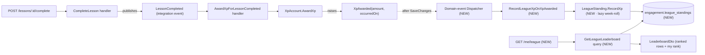
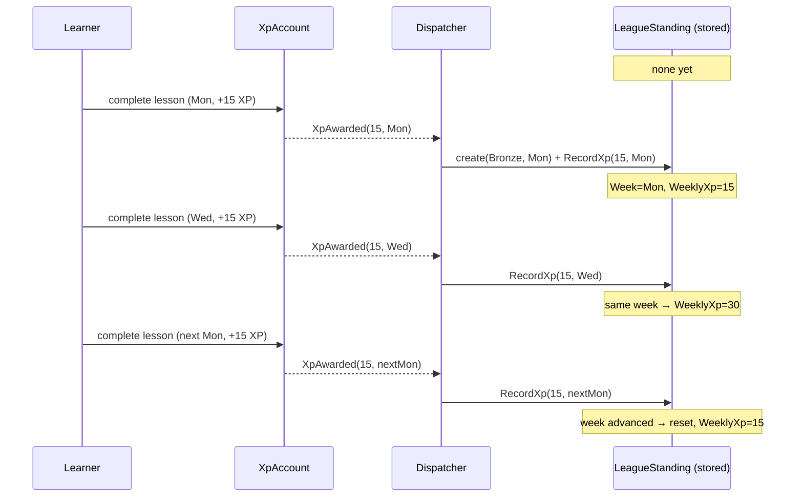
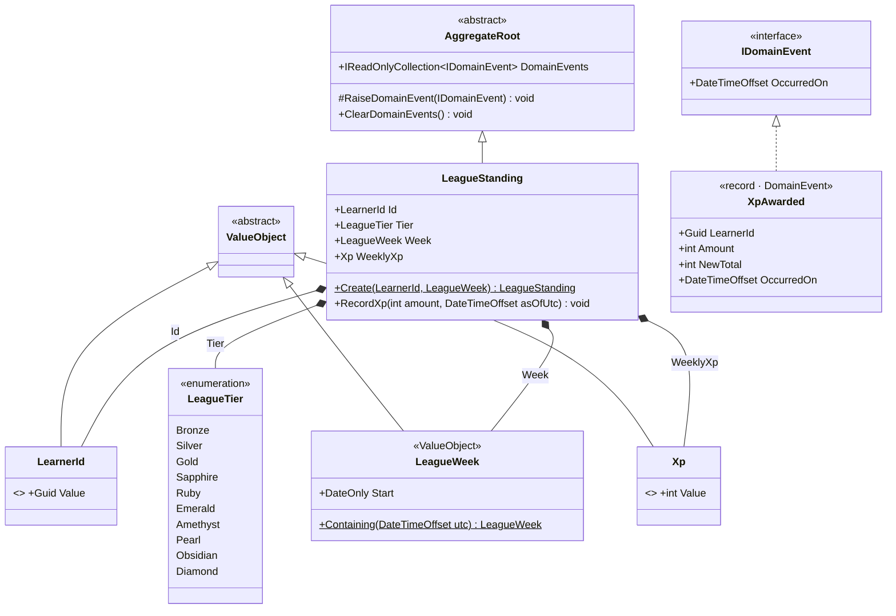
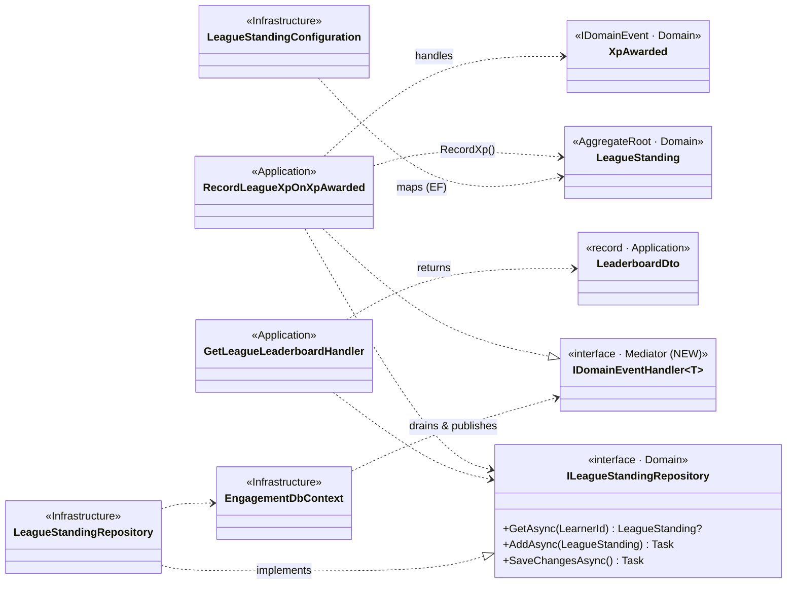

# Sub-project 4 — Leagues · Slice 1: League Skeleton

**Date:** 2026-06-11
**Status:** Approved (design)
**Builds on:** Sub-project 1 (XP skeleton) and Sub-project 2 (Streaks) — reuses the reactive-aggregate,
lazy-settlement, and pure-read-projection patterns.
**Part of:** **Leagues (Plan B — tiers + promotion/demotion)**, decomposed into two slices:
- **Slice 1 (this document):** weekly XP accumulation + the leaderboard read model.
- **Slice 2 (next):** cohort settlement — promotion/demotion at week close.

Original brainstorming visuals archived under [`./diagrams/`](./diagrams/) (prefix `leagues-`).

## Goal

Give Engagement a **weekly competitive standing**: as a learner earns XP, their score for the
current week accumulates, and they can read a **leaderboard** of everyone in their tier ranked by
that weekly XP. Slice 1 is the **walking skeleton** — it proves "earn XP → land in a tier → see
yourself ranked this week" end-to-end while keeping every write a small, single-aggregate change.
All learners sit in **Bronze**; tier *movement* (promotion/demotion) is deliberately deferred to
Slice 2.

Two non-negotiables carried from earlier sub-projects: **state stays derived** (the week rolls
lazily, no nightly job) and **idempotency is a domain rule** (re-delivered events never
double-count).

## The mechanic (settled in brainstorming — Plan B)

The full feature is classic Duolingo leagues:

- A **10-tier ladder**: Bronze → Silver → Gold → Sapphire → Ruby → Emerald → Amethyst → Pearl →
  Obsidian → Diamond.
- Each **week**, learners in a tier compete on a leaderboard ranked by **XP earned that week**.
- At week close, the **top 20% promote** one tier and the **bottom 20% demote** one tier; the
  middle stays. **Bronze** is the floor (no demotion); **Diamond** is the summit (no promotion).
- A new week is a **fresh start**: weekly XP resets to 0; lifetime `XpAccount` is untouched.

**Plan B simplification:** one cohort *per tier* (no splitting a tier into divisions of ~30, no
matchmaking — that is Plan C). Because a cohort is therefore variable-size, the movement rule is a
**percentage** (top/bottom 20%), which scales to any cohort size, rather than fixed counts.

**Slice 1 delivers only the left half of that mechanic** — accumulation and the leaderboard.
Promotion/demotion, the 20% rule, the rounding/edge rules, and the ladder neighbours all belong to
Slice 2.

## Scope

### In scope (Slice 1)
- A per-learner **`LeagueStanding`** aggregate (`Tier`, `Week`, `WeeklyXp`) that accumulates XP for
  the current UTC week and **lazily rolls** when a new week begins.
- A new **domain-event dispatcher** building block, so `LeagueStanding` can react to the existing
  **`XpAwarded`** domain event (today raised but discarded).
- A `RecordLeagueXpOnXpAwarded` handler (load-or-create the standing, record XP).
- A **`GET /me/league`** read model returning the requester's tier, the current week, and the
  tier's leaderboard ranked by weekly XP.

### Out of scope (deferred to Slice 2 or later)
- **Promotion / demotion**, the 20% rule, rounding, and ladder edges (Slice 2).
- **Populating tiers above Bronze** — with no settlement, every learner is Bronze (Slice 2 creates
  the higher tiers).
- **Cohort lifecycle / matchmaking / divisions of ~30** (Plan C).
- **A scheduler / outbox.** Dispatch is in-process, best-effort — the same reliability posture the
  codebase has today.
- **A `LeagueXpRecorded` domain event.** `LeagueStanding` raises nothing in Slice 1 (no
  subscriber); dispatch stays single-pass.

## Key design decisions (with rationale)

### 1. The week boundary — one canonical UTC week (not per-learner)

Streaks use each learner's **own timezone** (`LearnerTimeZone.LocalDateOf`), which is correct
because a streak is *personal* — my midnight is mine. A league cohort is **shared** by many
learners in different timezones; if each member's week flipped at their own local midnight, the
cohort would close at different instants for different people and the leaderboard would be
incoherent. A **shared, competitive** period therefore needs **one canonical clock**.

**Decision:** the league week is a **fixed UTC calendar week**, Monday 00:00 UTC → Sunday
23:59:59.999 UTC. Deterministic, no configuration, and a clean teaching contrast with the streak's
per-learner boundary. (A fixed *app* timezone or a per-cohort anchored 7-day cycle were considered;
the former is a one-line variant we can adopt later, the latter is cohort-lifecycle machinery that
belongs to Slice 2.)

### 2. Feeding the score — react to `XpAwarded` via a new dispatcher

Leagues rank by **XP earned**, and the exact amount already lives on the **`XpAwarded`** domain
event (`Amount`) raised by `XpAccount.AwardXp`. Reacting to it gives a **single source of truth**
(leagues count precisely what was awarded) and keeps leagues ignorant of *why* XP was earned
(future-proof against bonus rules and non-lesson XP).

Today `XpAwarded` is raised but **discarded** — `EngagementDbContext.SaveChangesAsync` clears
domain events with the note *"a real dispatcher arrives when a subscriber exists."* **Leagues is
that subscriber.** Slice 1 therefore builds a minimal domain-event dispatcher as a reusable
building block.

Two alternatives were rejected:
- *React to `LessonCompleted` and re-apply the XP policy* — duplicates the XP calculation in two
  places; the league total would silently drift from real XP if the policy changes.
- *Award XP and bump the score in one handler* — atomic and simple, but couples two
  responsibilities and writes two aggregates in one transaction, against the project's
  one-aggregate-per-transaction and event-decoupling leanings.

**Idempotency falls out for free.** `XpAwarded` is raised **at most once per award**: `AwardXp`
checks the `AppliedAward` ledger and returns early (raising nothing) for an already-applied source.
So a re-delivered `LessonCompleted` produces no second `XpAwarded`, and the weekly score cannot
double-count — without leagues adding any idempotency logic of its own.

### 3. The aggregate — per-learner `LeagueStanding` (not a cohort aggregate)

A `LeagueCohort` aggregate keyed by `(Tier, Week)` holding all members would make Slice 2's
settlement a tidy single-aggregate `Settle()` method — but on the **write path** it is a trap:
*every* learner's XP gain would mutate one **shared, unbounded, ever-growing** object, creating
write contention and a large-aggregate smell. Real Duolingo caps divisions at ~30 precisely to
bound this; our Plan-B cohort (a whole tier) is unbounded.

**Decision:** a small **per-learner `LeagueStanding`** aggregate on the write path; the cohort /
leaderboard is a **read-model projection** (a filtered, ordered query over standings — no
cross-aggregate JOIN). This keeps writes small and uncontended and mirrors `LearnerStreak` exactly.
The honest consequence is that Slice 2's settlement becomes a **cross-aggregate process** (rank the
query, update each standing) rather than an aggregate method — but cohort-wide settlement is the
challenge we already chose to confront in Slice 2, so this places it where it belongs rather than
hiding it.

## The core model — `LeagueStanding`

One small aggregate per learner. The only behaviour is recording XP, and it carries the **lazy
week-roll** — the same "settle on the next real activity, never on a timer" idea as `LearnerStreak`.

### Creation and write — `Create` + `RecordXp(amount, asOfUtc)`

A standing is **created lazily** on a learner's first XP, then XP is recorded — the same
`Create` → behaviour split as `LearnerStreak`:

- `Create(LearnerId id, LeagueWeek week)` → `Tier = Bronze`, `Week = week`, `WeeklyXp = Xp.Zero`.
- `RecordXp(int amount, DateTimeOffset asOfUtc)`, with `w = LeagueWeek.Containing(asOfUtc)`:

| Condition | Effect |
|---|---|
| `w > Week` (a later week) | **lazy roll** — `WeeklyXp = amount`, `Week = w` |
| `w == Week` (same week) | `WeeklyXp += amount` |
| `w < Week` (clock moved back) | **ignored** — defensive guard; cannot resurrect a past week |

The handler creates the standing for the current week and then calls `RecordXp`, so a brand-new
standing takes the `w == Week` branch. `LeagueStanding` raises no domain event in Slice 1.

#### Where "now" comes from (decided)

The week is derived from the **injected `TimeProvider`** at handling time (`clock.GetUtcNow()`),
**not** from `XpAwarded.OccurredOn`. That field is stamped with the award-*processing* instant
inside `XpAccount.AwardXp` — not the lesson's time — so it is not a trustworthy earn-time and we
deliberately do not key the week off it. Deriving "now" from the clock (exactly as
`GetLearnerStreakHandler` already does for reads) keeps both league handlers testable through the
existing `FakeTimeProvider` seam and changes **no existing XP code**. Because the dispatcher runs
in-process within the same request, handling time equals request time, so the handling-vs-earn-time
gap is negligible. (Threading a true earn-time through `XpAwarded` is a possible future refinement
if asynchronous dispatch / an outbox is ever introduced — at which point the `w < Week` guard stops
being merely defensive.)

### Read — the leaderboard projection (pure, no mutation)

Let `now` come from the injected `TimeProvider` and `current = LeagueWeek.Containing(now)`. For a
requester `r`:

- `tier = r`'s stored `Tier` if a standing exists, else **Bronze** (the default).
- `rows = standings WHERE Tier == tier AND Week == current ORDER BY WeeklyXp DESC`, each assigned a
  1-based `Rank` by position.
- `myRank = r`'s position in `rows`, or **null** if `r` has no current-week standing.

A standing whose stored `Week` is **stale** (an earlier week) is simply **absent** from `current`
— i.e. it counts as 0 this week without being mutated. This is the same "the read re-applies the
write-path rule without mutating" property as `StreakReport`: what a learner sees before studying
is exactly what the next `RecordXp` will build on.

## The domain-event dispatcher (new building block)

`XpAwarded` implements `IDomainEvent`, which is distinct from the cross-module `INotification`
(integration events in `Contracts`). The dispatcher introduces a parallel, **in-process,
intra-module** path:

- A new handler abstraction **`IDomainEventHandler<TEvent>`** (in `BuildingBlocks.Mediator`),
  kept separate from `INotificationHandler` so domain events and integration events don't blur.
- After a unit of work is **persisted**, the domain events raised by its tracked aggregates are
  **drained and published** to their `IDomainEventHandler`s, then cleared (replacing the current
  "just clear" no-op in `EngagementDbContext.SaveChangesAsync`).
- Slice 1's only handler (`RecordLeagueXpOnXpAwarded`) updates a `LeagueStanding`, which raises
  **no** further domain events — so dispatch is **single-pass** with no cascade or re-entrancy
  concern.

**Reliability posture:** dispatch is in-process and best-effort (no outbox) — if a handler fails,
the originating XP write is already committed. This matches the codebase's current maturity; a
durable outbox is a future cross-cutting sub-project, not a Slice-1 concern.

**Settled in the plan, not here:** the precise publish-and-re-entrancy handling. The natural drain
point is `EngagementDbContext.SaveChangesAsync`, which already iterates tracked aggregates to clear
events; whether handlers run inside that override or via a thin behavior it invokes is a plan
detail. The design constraint is only: *publish after the XP write is durable, and never
double-dispatch.*

## Data flow

### Accumulation and the lazy week-roll

## Tactical model

### Cross-layer wiring (dispatcher, handlers, repository port, EF adapter)

The arrows point **inward**: every Application handler depends on `ILeagueStandingRepository` (owned
by the **Domain**); Infrastructure implements it and maps the aggregate. The Domain references
nothing infrastructural.

## Components

### BuildingBlocks (`BuildingBlocks.Mediator`)
- **`IDomainEventHandler<TEvent>`** — new abstraction for intra-module domain-event handlers.
- **Domain-event dispatch** — drain raised `IDomainEvent`s after a persisted unit of work and
  publish to handlers (mechanism finalized in the plan).

### Domain (`Engagement.Domain`)
- **`LeagueStanding`** — aggregate root: `Id: LearnerId`, `Tier: LeagueTier`, `Week: LeagueWeek`,
  `WeeklyXp: Xp`; `Create(...)`; `RecordXp(amount, asOfUtc)` with the lazy week-roll.
- **`LeagueTier`** — enum, Bronze → Diamond (minimal in Slice 1; neighbour/ordering logic added in
  Slice 2).
- **`LeagueWeek`** — value object wrapping `DateOnly Start` (the UTC Monday); `Containing(utc)`.
- **`ILeagueStandingRepository`** — `GetAsync` / `AddAsync` / `SaveChangesAsync`, plus the read used
  by the leaderboard (the ordered, filtered query over standings).

### Application (`Engagement.Application`)
- **`RecordLeagueXpOnXpAwarded : IDomainEventHandler<XpAwarded>`** — injects `TimeProvider`;
  computes `now = clock.GetUtcNow()`, load-or-creates the standing for `LeagueWeek.Containing(now)`,
  calls `RecordXp(e.Amount, now)`, saves. Mirrors `RegisterStreakForLessonCompletedHandler` — the
  handler supplies the time, the aggregate stays clock-free.
- **`GetLeagueLeaderboard`** query + **`LeaderboardDto`** + handler — one CQRS slice in one file
  (`GetLeagueLeaderboard.cs`), per the project's file-organization convention. Injects
  `TimeProvider` to resolve the current week.
  `LeaderboardDto { string Tier, DateOnly WeekStart, IReadOnlyList<LeaderboardRow> Rows, int? MyRank }`,
  `LeaderboardRow(int Rank, Guid LearnerId, int WeeklyXp)`.

### Infrastructure (`Engagement.Infrastructure`)
- **`LeagueStandingConfiguration`** — map `LeagueStanding` to `engagement.league_standings`:
  `LearnerId` (PK, conversion), `Tier` (string or int), `WeekStart` (date, from `LeagueWeek`),
  `WeeklyXp` (int, from `Xp`). Mirrors `XpAccountConfiguration` / `LearnerStreakConfiguration`.
- **`LeagueStandingRepository`** — implements the port; the leaderboard read is a filtered/ordered
  query.
- **Migration `AddLeagueStanding`** — create `engagement.league_standings`.
- Register `LeagueStanding`'s `DbSet`; wire the domain-event dispatcher into the DbContext.

### Host
- **`GET /me/league`** → `GetLeagueLeaderboard(user.LearnerId)` → `LeaderboardDto`, learner from
  `ICurrentUser`. Returns **200** always (an unknown learner gets the Bronze board with `MyRank: null`).

## Error handling

- **`GET /me/league` for an unknown learner** (no standing) — **200**, `Tier: "Bronze"`, current
  `WeekStart`, the current Bronze board, `MyRank: null`. No 404.
- **Stale-week standing** — never mutated by a read; simply excluded from the current week's board.
- **Clock skew** (`w < Week`) — ignored by `RecordXp`; a past week cannot be revived (defensive,
  since the handling clock is normally monotonic).
- **Dispatcher handler failure** — the XP write is already committed; the weekly score misses that
  award (accepted: best-effort, no outbox in Slice 1).
- **Re-delivered `LessonCompleted`** — produces no second `XpAwarded` (the `AppliedAward` ledger),
  so the weekly score never double-counts.

## Testing

**Domain (`Engagement.Domain.Tests`) — fast, pure:**
- `Create` then a first `RecordXp` yields a Bronze standing for that week with `WeeklyXp = amount`.
- Two awards in the **same** UTC week accumulate (`+=`).
- An award in a **later** week resets `WeeklyXp` (lazy roll); the prior week's total does not carry.
- A `w < Week` `RecordXp` (clock moved back) is ignored (defensive guard).
- `LeagueWeek.Containing` maps instants to the correct UTC Monday across the **Sunday→Monday
  boundary** (e.g. Sun 23:59:59 UTC and Mon 00:00:00 UTC fall in different weeks).

**Integration (`Engagement.Integration.Tests`):**
- The **dispatcher** delivers `XpAwarded` to `RecordLeagueXpOnXpAwarded` after the XP write is
  persisted (and existing `XpAwarded`-clearing behaviour no longer silently drops it).
- Persistence round-trip of a `LeagueStanding`.
- The leaderboard query **ranks** by `WeeklyXp` desc and **filters** by tier + current week; a
  stale-week standing is excluded; `MyRank` is correct (and null when absent).
- **End-to-end with `FakeTimeProvider`** (mirroring `StreakApiTests`: publish `LessonCompleted` via
  the mediator and drive the week with `Clock.SetUtcNow`): two learners earn XP in one UTC week →
  `GET /me/league` ranks them by weekly XP; advance the clock into the next week → neither appears on
  the new week's board until they earn again (projection reset), and a fresh earn rolls the stored
  `WeeklyXp`; re-deliver a `LessonCompleted` → **no double-count**.

**Architecture (`Engagement.Integration.Tests/Architecture`):**
- New `Engagement.Domain` types reference nothing infrastructural (NetArchTest), and the
  `IDomainEventHandler` abstraction lives in `BuildingBlocks.Mediator`.

## Acceptance criteria

1. Earning XP creates or updates a per-learner `LeagueStanding` in **Bronze** for the **current UTC
   week**, adding the awarded amount to `WeeklyXp`.
2. XP earned in a **new** UTC week resets `WeeklyXp` (lazy roll); the previous week's total does not
   carry over.
3. `GET /me/league` returns the requester's tier (Bronze), the current `WeekStart`, and the Bronze
   board ranked by `WeeklyXp` descending, with the requester's `MyRank`.
4. A **re-delivered** `LessonCompleted` does not double-count weekly XP (no second `XpAwarded`).
5. The leaderboard read **never mutates** stored standings; a stale-week standing is absent from the
   current board.
6. An **unknown learner** reading `GET /me/league` receives the Bronze board with `MyRank: null`,
   no error.
7. The domain-event dispatcher delivers `XpAwarded` to its handler after the XP write is durable,
   and **all existing XP and streak tests pass unchanged**.
8. New `Engagement.Domain` types reference nothing infrastructural (architecture test).

## What Slice 2 inherits

Slice 2 (settlement) closes the week: rank each tier's current-week standings, **promote the top
20% / demote the bottom 20%** (with a rounding rule and the Bronze/Diamond edges), reset weekly
scores, and populate the higher tiers. Its central problem — **cohort-wide settlement with no
scheduler** — is exactly what the per-learner aggregate choice defers here, to be confronted on a
working foundation.
