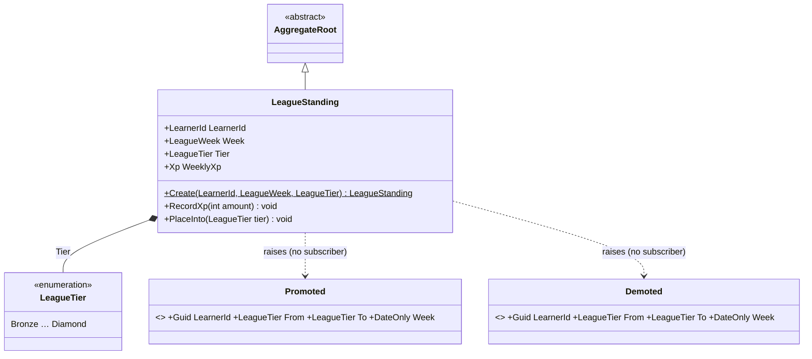
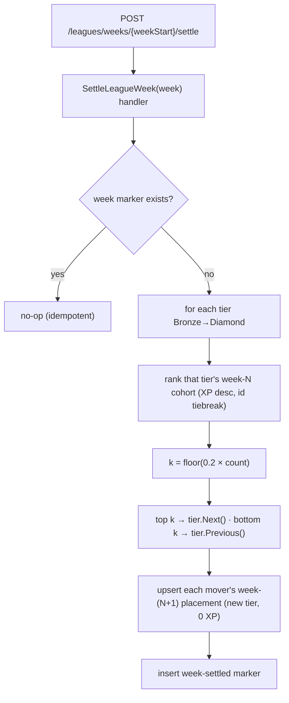

# Sub-project 4 — Leagues · Slice 2: Settlement

**Date:** 2026-06-12
**Status:** Approved (design)
**Builds on:** Leagues Slice 1 (skeleton) — [`2026-06-11-leagues-skeleton-design.md`](./2026-06-11-leagues-skeleton-design.md)
**Part of:** Leagues (Plan B — tiers + promotion/demotion). Slice 1 delivered weekly accumulation + the
leaderboard; **this slice closes the week and moves learners between tiers.**

Original brainstorming visuals archived under [`./diagrams/`](./diagrams/) (prefix `leagues-s2-`).

## Goal

Close a league week: rank each tier's cohort and **promote the top slice / demote the bottom slice**,
so learners climb and fall the Bronze→Diamond ladder week over week. The hard part — flagged when we
deferred it in Slice 1 — is that settlement is **cohort-wide** (you must rank a whole tier to decide
who moves), so it cannot be a single per-learner write. This slice builds the settlement **operation**
behind an explicit seam; what *automatically* closes a week is deferred.

Two commitments carried forward: **idempotency is a domain rule** (re-settling a week is a no-op) and
the read model stays a **pure projection** (unchanged from Slice 1).

## The decisions (settled in brainstorming)

1. **Trigger — explicit `SettleLeagueWeek` command (a seam).** Build the settlement *logic* now,
   invoked by a command/endpoint (and tests); **defer the automatic trigger** (a scheduler, or
   lazy-on-activity) to a later increment. This mirrors how the project separates a rich operation
   from its real-world driver — `Learning.Stub` for the real engine, `GrantStreakFreeze` for a real
   economy. A background job (breaks the "no nightly job" stance) and lazy cohort-settlement (heavy
   cross-aggregate write triggered by one learner, with concurrency) were both considered and
   deferred, not chosen, for this slice.
2. **Model — one row per `(learner, week)`.** Slice 1's single mutable row per learner *overwrites*
   week-N data on the next week's first activity (`RecordXp`'s lazy roll), destroying exactly what
   settlement needs to rank. Per-week rows preserve history; settlement reads week-N rows whenever it
   runs.
3. **Rule — `floor(0.2 × N)` promote / `floor(0.2 × N)` demote.** Because `2·floor(0.2N) < N` for all
   N, there is **always** a non-empty "stay" middle and **no learner can be both** promoted and
   demoted — no special small-cohort guard. Cohorts of ≤4 don't move. **Bronze** is the floor (its
   bottom slice stays) and **Diamond** the summit (its top slice stays). Ties at a boundary break by a
   **stable `LearnerId` sort** — already how the cohort query orders, so settlement is deterministic.

## Scope

### In scope
- Reshape **`LeagueStanding`** to identity `(LearnerId, Week)`; move week-selection out of the
  aggregate into the handler; carry the tier forward on a new week's first activity.
- **`LeagueTier`** ladder movement: `Next()` / `Previous()` with edge clamping.
- **`SettleLeagueWeek(LeagueWeek)`** command + handler (rank, move, write next-week placements),
  idempotent via a **per-week settled marker**.
- A **`POST /leagues/weeks/{weekStart}/settle`** endpoint (the explicit trigger seam).
- Subscriber-less **`Promoted` / `Demoted`** domain events (pattern-consistent; the dispatcher built
  in Slice 1 carries them; no subscriber yet).
- Persistence: PK migration, the marker table, and the repository methods settlement needs.

### Out of scope (deferred)
- **The automatic trigger** — what closes a week without a manual call (scheduler or lazy-on-activity).
  The command/endpoint is the seam; the real driver is a future increment.
- **Divisions of ~30 / matchmaking** (Plan C). A cohort is still the whole tier for a week.
- **Diamond tournament**, demotion-protection grace periods, or any "inactivity" special-casing
  (bottom-20%-by-XP already sweeps up zero-XP learners).
- **An outbox.** Domain-event dispatch stays in-process best-effort, as in Slice 1.

## Model reshape — `LeagueStanding` becomes per-(learner, week)

Slice 1's `LeagueStanding` was keyed by `LearnerId` and `RecordXp` did a lazy week-roll that
overwrote `Week`/`WeeklyXp`. In Slice 2 the identity is **`(LearnerId, Week)`**, so:

- A row is **one fixed week** — `RecordXp(amount)` simply *adds* to that row (no roll, no week
  comparison, no clock inside the aggregate).
- `Create(LearnerId, LeagueWeek, LeagueTier)` now takes the tier (no longer hard-coded Bronze), so a
  promoted/demoted placement can be created at the right tier.
- **Week selection moves to the handler.** `RecordLeagueXpOnXpAwarded` resolves `now` from the
  injected `TimeProvider`, computes the current `LeagueWeek`, and **find-or-creates that week's row**:
  on create, `Tier` is **carried forward** from the learner's most-recent prior row (Bronze if none).
  Then `RecordXp(amount)`.

`LeagueTier` gains pure helpers (kept on the enum via extension methods or a small static):
`Next()` (Diamond → Diamond) and `Previous()` (Bronze → Bronze).

## The settlement operation — `SettleLeagueWeek(week)`

Algorithm, per tier `T` for the week being settled:
1. `cohort = ` ranked week-N standings in `T` (XP desc, `LearnerId` tiebreak — the existing
   `GetCohortAsync`).
2. `k = floor(0.2 × cohort.Count)`.
3. Top `k`: `newTier = T.Next()`. Bottom `k`: `newTier = T.Previous()`. The rest stay.
4. For each learner whose `newTier != T` (a **mover**): **upsert their week-(N+1) row** — create it at
   `newTier` with `WeeklyXp = 0` if absent; if it already exists (they earned early in N+1 at the
   carried-forward tier), set its tier to `newTier`, keeping its XP. Raise `Promoted`/`Demoted`.
5. After all tiers: **insert the week-settled marker.**

**Stayers** get no settlement write. When a stayer next plays, the handler's carry-forward creates
their next row at their (unchanged) tier — correct without settlement touching them.

**Idempotency.** A **per-week settled marker** (one row per settled `WeekStart`) makes a second
`SettleLeagueWeek(sameWeek)` a no-op — the same "idempotency is a domain rule" theme as the
`AppliedAward` ledger. Settlement and the marker insert happen in one unit of work.

## Components

### Domain (`Engagement.Domain`)
- **`LeagueStanding`** — identity `(LearnerId, Week)`; `Create(id, week, tier)`; `RecordXp(amount)`
  (add-only); `PlaceInto(tier)` for settlement to set a mover's tier (raises `Promoted`/`Demoted`).
- **`LeagueTier`** — add `Next()`/`Previous()` (edge-clamped).
- **`Promoted`**, **`Demoted`** — new `IDomainEvent`s (no subscriber yet).
- **`LeagueWeekSettlement`** — tiny aggregate/entity marking a settled week (`Week`, `SettledAt`).
- **`ILeagueStandingRepository`** — add `GetAsync(LearnerId, LeagueWeek)`,
  `GetMostRecentAsync(LearnerId)` (carry-forward + leaderboard tier); keep `GetCohortAsync(tier, week)`.
- **`ILeagueWeekSettlementRepository`** — `ExistsAsync(week)`, `AddAsync(marker)`, `SaveChangesAsync`.

### Application (`Engagement.Application`)
- **`SettleLeagueWeek(DateOnly WeekStart)`** command + handler — the algorithm above.
- **`RecordLeagueXpOnXpAwarded`** — updated to find-or-create the current week's row with carry-forward
  tier (was: load single row + lazy-roll).
- **`GetLeagueLeaderboard`** — updated to resolve the requester's tier via `GetMostRecentAsync` /
  current-week row instead of the old single-row `GetAsync`. Ranking/projection otherwise unchanged.

### Infrastructure (`Engagement.Infrastructure`)
- `LeagueStandingConfiguration` — composite key `(LearnerId, WeekStart)`.
- New `LeagueWeekSettlementConfiguration` + table `LeagueWeekSettlements`.
- Repositories for both; register in DI.
- Migration **`AddLeagueSettlement`** — change `LeagueStandings` PK to `(LearnerId, WeekStart)`; add
  `LeagueWeekSettlements`.

### Host
- **`POST /leagues/weeks/{weekStart}/settle`** → `SettleLeagueWeek`. Returns **200** (idempotent;
  settling an already-settled or empty week is a no-op 200). This is an operational/seam endpoint, not
  a `/me` one.

## Error handling

- **Re-settling a week** — no-op via the marker; **200**.
- **Settling a week with no standings / tiny cohorts (≤4)** — nothing moves; marker still inserted;
  **200**.
- **A learner earning in N+1 before week N is settled** — their N+1 row is created at the
  carried-forward (old) tier; settlement then **reconciles** it to the new tier, keeping the XP. A
  transient "wrong tier on the N+1 board" window is accepted under the explicit-settlement model.
- **`{weekStart}` that isn't a Monday** — `LeagueWeek`'s constructor rejects it; the endpoint returns
  **400** (bad input), mirroring the timezone-validation precedent.
- **Dispatcher handler failure** for `Promoted`/`Demoted` — no subscriber exists, so dispatch is a
  no-op; settlement is unaffected.

## Backward compatibility

The per-(learner, week) reshape changes `LeagueStanding`'s key, `RecordXp`'s signature, the XP
handler, and the leaderboard tier-resolution — so **Slice 1's *league* tests are updated** to the new
model as part of this slice (the in-memory repo, the persistence round-trip, the handler/leaderboard
app tests). This is an intentional evolution, **not** a regression. The contract that must stay green
untouched is everything **outside** leagues — all XP, streak, mediator, and architecture tests — plus
the externally observable leaderboard behaviour from Slice 1 (earning ranks you in your tier this
week; the read never mutates). New migrations recreate the table; test DBs `EnsureDeleted` + `Migrate`,
so there is no data-migration step in tests.

## Testing

**Domain (`Engagement.Domain.Tests`) — fast, pure:**
- `LeagueTier.Next()`/`Previous()` step the ladder and **clamp at Bronze/Diamond**.
- `LeagueStanding.RecordXp` adds within a fixed-week row; `PlaceInto` changes tier and raises the
  right event (`Promoted` when up, `Demoted` when down).
- A pure settlement-rule unit (the ranking → movers selection): `floor` counts incl. ≤4 → no move;
  top-k/bottom-k selection; tie-break determinism.

**Integration (`Engagement.Integration.Tests`):**
- Composite-key round-trip of `LeagueStanding`; two rows for the same learner in different weeks
  coexist.
- `SettleLeagueWeek` promotes the top slice, demotes the bottom, leaves the middle, and writes
  week-(N+1) placements at the new tiers.
- **Re-settling the same week is a no-op** (marker).
- Carry-forward: the XP handler creates a new week's row at the prior tier; after settlement, a mover's
  next row reflects the new tier.

**End-to-end (`Engagement.Integration.Tests`, `FakeTimeProvider`):**
- Two learners earn in week 1 (Bronze) → `POST /leagues/weeks/{mon}/settle` → advancing the clock to
  week 2, the promoted learner's `GET /me/league` shows the higher tier; settling twice does not
  double-move.

**Architecture:** new Domain types reference nothing infrastructural (NetArchTest, existing test
covers the assembly).

## Acceptance criteria

1. After `SettleLeagueWeek(weekN)`, each tier's **top `floor(0.2×N)`** are placed one tier **up** and
   **bottom `floor(0.2×N)`** one tier **down** for week N+1; the middle stays.
2. **Bronze** never demotes below itself; **Diamond** never promotes above itself.
3. Settling a week is **idempotent** — a second call moves no one.
4. A learner's **week-N result survives** their week-N+1 activity (per-(learner, week) rows), so
   settlement ranks real final standings.
5. `GET /me/league` reflects a learner's **new tier** after settlement; the read still never mutates.
6. Cohorts of **≤4 don't move**; no learner is ever both promoted and demoted.
7. `POST /leagues/weeks/{weekStart}/settle` returns **200** (no-op for already-settled/empty weeks) and
   **400** for a non-Monday `weekStart`.
8. New `Engagement.Domain` types reference nothing infrastructural.

## What a later increment inherits

The **automatic trigger** — the only deferred piece. A future increment chooses how a week closes
without a manual call: a scheduled job that calls `SettleLeagueWeek` at the boundary, or lazy
settlement on first activity in the new week. Either one *drives* the operation this slice builds; the
domain logic doesn't change.
