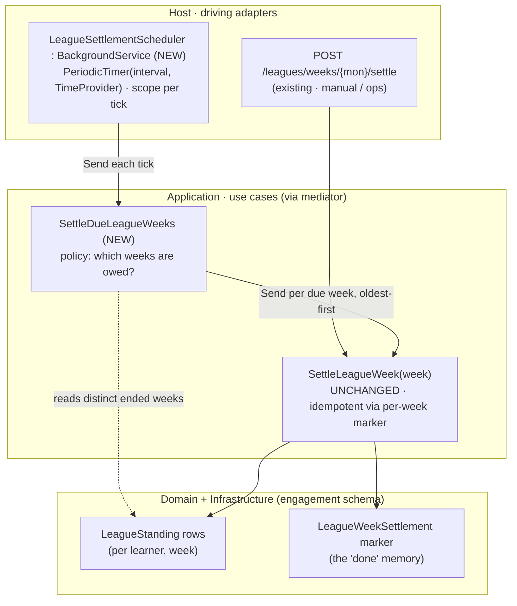

# Sub-project 4 — Leagues · Slice 3: Automatic settlement trigger

**Date:** 2026-06-16
**Status:** Approved (design)
**Builds on:** Leagues Slice 2 (settlement) — [`2026-06-12-leagues-settlement-design.md`](./2026-06-12-leagues-settlement-design.md)
**Part of:** Leagues (Plan B — tiers + promotion/demotion). Slice 1 delivered weekly accumulation +
the leaderboard; Slice 2 built the settlement **operation** behind an explicit seam; **this slice
makes the close happen on its own** — the one piece Slices 1 and 2 deliberately deferred.

Original brainstorming visuals archived under [`./diagrams/`](./diagrams/) (prefix `leagues-s3-`).

## Goal

Close a league week **without a human calling the endpoint.** Slice 2 left exactly one thing open:
"what *automatically* closes a week — a scheduler, or lazy-on-activity?" This slice answers it with a
**time-driven push**: a .NET `BackgroundService` that periodically asks the application to settle any
week that has ended but isn't settled yet. The Slice-2 operation (`SettleLeagueWeek`) is **reused
verbatim** — this slice adds only a *driver* and the thin *policy* that decides which weeks are owed.

## The decisions (settled in brainstorming)

1. **Trigger model — a scheduled push (`BackgroundService`), not lazy-on-activity.** The two honest
   options were a *prompt close* at the week boundary (needs a scheduler) and a *lazy close* on the
   next learner activity (consistent with the streak-freeze precedent / the repo's "no nightly job"
   stance). We chose the **scheduler**. The product reason: a closed week becomes "final" promptly and
   predictably, regardless of whether anyone plays. The **explicit, decisive reason**: this is a
   learning project and the author wants to learn how .NET background-service scheduling works — a
   legitimate reason to adopt a new pattern over the more on-theme lazy approach. This is the project's
   **first** `BackgroundService`.
2. **Loop strategy — periodic poll + idempotent catch-up, not sleep-until-boundary.** Each tick:
   *"find every ended week that still has no settlement marker and settle them oldest-first."* This is
   robust to any downtime — if the Host is offline across one or more Monday boundaries, the missed
   weeks settle on the next tick after it returns, in order. The alternative (compute the next Monday
   00:00 UTC and delay until exactly then) fires precisely but **sleeps through** any boundary the Host
   misses, so it would need catch-up-on-startup bolted on anyway — at which point it has re-implemented
   the poll strategy, plus fragile deadline math. The poll strategy is also the better thing to learn:
   it is the canonical shape of schedulers, outbox processors, and reconciliation jobs — *a loop that
   polls + an idempotent operation that owns its own "done" marker.*
3. **Reuse `SettleLeagueWeek` per due week — one send = one unit of work.** The new policy command
   loops over due weeks and **sends `SettleLeagueWeek(week)` for each**, oldest-first. Sending the
   existing command (rather than re-implementing) means each week is its **own committed transaction**,
   which the settlement **chain requires**: week N's promotions must be persisted before week N+1 is
   ranked, because N+1's cohorts must include the movers N just produced. (Considered alternative:
   extract a shared `ILeagueWeekSettler` service both the endpoint and the driver call — more types,
   same effect. The nested send was chosen for maximal reuse of the tested operation.)
4. **Policy in Application, mechanism in Host.** "Which weeks are owed a settlement?" is application
   logic — a normal use case (`SettleDueLeagueWeeks`), testable with **zero hosting**. The
   `BackgroundService` is pure mechanism: a timer, a DI scope per tick, and lifecycle. The scheduler is
   just **another driving adapter**, sitting beside the existing HTTP endpoint — both pull the same
   trigger.
5. **No live end-to-end test this slice.** A focused mechanism test (the loop) plus a policy test (due
   weeks) cover both new risks deterministically. A full-host test of the live scheduler would need
   poll-with-timeout against a background loop (mild flakiness) for little extra confidence — skipped,
   easy to add later.

## Scope

### In scope
- **`LeagueSettlementScheduler : BackgroundService`** (Host) — a `PeriodicTimer` driven by the injected
  `TimeProvider`; opens an `IServiceScopeFactory` scope per tick and sends `SettleDueLeagueWeeks`;
  survives a failing tick; stops cleanly on shutdown. Runs an initial pass on startup, then every
  interval.
- **`LeagueSettlementOptions`** (Host) — `Enabled` (default `true`) and `PollInterval` (default 1h),
  bound from the `Leagues:Settlement` config section; `appsettings.json` entry.
- **`SettleDueLeagueWeeks`** command + handler (Application) — resolve "now" from `TimeProvider`, find
  the distinct **ended** weeks that have standings, and send `SettleLeagueWeek` for each, oldest-first.
- **`ILeagueStandingRepository.GetDistinctEndedWeeksAsync(currentWeek)`** (Domain interface) + its
  Infrastructure implementation — the one new query.
- **Program wiring** — bind the options; register the hosted service **only when** `Enabled`.
- **Test-host isolation** — the 4 `WebApplicationFactory<Program>` hosts set
  `Leagues:Settlement:Enabled=false`.
- Tests: a policy/integration test for `SettleDueLeagueWeeks` and a focused mechanism test for the
  scheduler loop.

### Out of scope (deferred)
- **A subscriber for `Promoted` / `Demoted`** — still none; the events remain raised-but-unhandled.
- **Multi-instance coordination** — one Host = one scheduler (correct, sequential). Two Hosts = two
  schedulers that could collide on the marker insert; true distributed locking / leader election is not
  solved here.
- **Exact-midnight precision** — settlement fires within one poll interval of the boundary, not at the
  instant of it.
- **Divisions / matchmaking, Diamond tournament, demotion-protection grace** (Plan C and beyond).
- **An outbox / durable event delivery** — domain-event dispatch stays in-process best-effort.
- **Any change to the settlement algorithm itself** — `SettleLeagueWeek` is untouched.
- **A live end-to-end smoke test** of the running scheduler (see decision 5).

## Architecture & data flow

The scheduler is a second **driving adapter** for the settlement operation. It drives a thin new
*policy* command, which reuses the unchanged Slice-2 *operation*.



A tick, including the catch-up case (Host was offline across the W2→W3 and W3→W4 boundaries, returns
during W4):

```mermaid
sequenceDiagram
    participant T as PeriodicTimer (TimeProvider)
    participant S as Scheduler
    participant M as Mediator
    participant D as SettleDueLeagueWeeks
    participant O as SettleLeagueWeek
    T->>S: tick (every interval)
    S->>M: Send(SettleDueLeagueWeeks)
    M->>D: handle
    Note over D: due = [W2, W3] — ended & have standings; W4 is current → skipped
    D->>O: Send(SettleLeagueWeek W2)
    O-->>D: W2 promotions + W2 marker committed
    D->>O: Send(SettleLeagueWeek W3)
    O-->>D: W3 ranked incl. W2 movers + W3 marker committed
    Note over D,O: next tick → W2/W3 markers exist → both no-op
```

## Components

### Host
- **`LeagueSettlementScheduler : BackgroundService`** — pure mechanism. Three lessons are baked in:
  1. A `BackgroundService` is a **singleton**, so it cannot hold the scoped `IMediator`/
     `EngagementDbContext`; it opens an `IServiceScopeFactory` scope **per tick**.
  2. `PeriodicTimer` is constructed with the injected **`TimeProvider`**, so `FakeTimeProvider` drives
     it deterministically in tests (no real waiting). `do { … } while (await WaitForNextTickAsync(…))`
     runs an initial pass on startup (fast catch-up), then every interval.
  3. A failing tick is **logged and swallowed** — an unhandled exception in `ExecuteAsync` silently
     kills the service for the Host's whole lifetime, so the loop must survive a transient DB blip.
     `OperationCanceledException` from the wait ends the loop cleanly on shutdown.

  ```csharp
  protected override async Task ExecuteAsync(CancellationToken stoppingToken)
  {
      using var timer = new PeriodicTimer(options.Value.PollInterval, clock);
      try
      {
          do
          {
              try
              {
                  using var scope = scopeFactory.CreateScope();
                  var mediator = scope.ServiceProvider.GetRequiredService<IMediator>();
                  await mediator.SendAsync(new SettleDueLeagueWeeks(), stoppingToken);
              }
              catch (Exception ex) when (ex is not OperationCanceledException)
              {
                  logger.LogError(ex, "League settlement tick failed; retrying next interval.");
              }
          }
          while (await timer.WaitForNextTickAsync(stoppingToken));
      }
      catch (OperationCanceledException) { /* host is shutting down — expected, exit cleanly */ }
  }
  ```

- **`LeagueSettlementOptions`** — `{ bool Enabled = true; TimeSpan PollInterval = TimeSpan.FromHours(1); }`.

### Application (`Engagement.Application`)
- **`SettleDueLeagueWeeks`** command + handler:

  ```csharp
  public sealed record SettleDueLeagueWeeks : IRequest<Unit>;

  public sealed class SettleDueLeagueWeeksHandler(
      ILeagueStandingRepository standings, IMediator mediator, TimeProvider clock)
      : IRequestHandler<SettleDueLeagueWeeks, Unit>
  {
      public async Task<Unit> HandleAsync(SettleDueLeagueWeeks _, CancellationToken ct)
      {
          var current = LeagueWeek.Containing(clock.GetUtcNow());
          var due = await standings.GetDistinctEndedWeeksAsync(current, ct); // ascending
          foreach (var week in due)                       // oldest first → chain holds
              await mediator.SendAsync(new SettleLeagueWeek(week.Start), ct); // idempotent
          return Unit.Value;
      }
  }
  ```

  Only weeks that **have standings** are candidates, so a truly empty week is never settled.
  Already-settled weeks are no-ops via the Slice-2 marker, so re-ticking is safe and cheap.

### Domain (`Engagement.Domain`)
- **`ILeagueStandingRepository.GetDistinctEndedWeeksAsync(LeagueWeek currentWeek, CancellationToken)`**
  → `IReadOnlyList<LeagueWeek>`, ascending, of distinct weeks **strictly before** `currentWeek` that
  have at least one standing.

### Infrastructure (`Engagement.Infrastructure`)
- Implement the query. **EF value-converter constraint:** EF can translate `==` / `OrderBy` on a whole
  value object but not `<` on a converted member, so we materialise the (tiny) distinct-week set, then
  filter and sort **in memory**:

  ```csharp
  var weeks = await db.LeagueStandings.Select(s => s.Week).Distinct().ToListAsync(ct);
  return weeks.Where(w => w.Start < currentWeek.Start).OrderBy(w => w.Start).ToList();
  ```

- **No schema change, no migration** — the Slice-2 `LeagueWeekSettlement` marker is all the state
  needed. (First leagues slice without a migration.)

### Program wiring
```csharp
builder.Services.Configure<LeagueSettlementOptions>(
    builder.Configuration.GetSection("Leagues:Settlement"));
if (builder.Configuration.GetValue("Leagues:Settlement:Enabled", true))
    builder.Services.AddHostedService<LeagueSettlementScheduler>();
```

## Configuration

`appsettings.json` gains a `Leagues:Settlement` section:

```json
"Leagues": { "Settlement": { "Enabled": true, "PollInterval": "01:00:00" } }
```

- **`Enabled`** — feature flag for the hosted service; the 4 test hosts set it `false`.
- **`PollInterval`** — poll cadence; tests inject their own short interval where relevant.

## Error handling / edges

- **A tick fails (DB blip):** logged and swallowed; the loop survives and retries next interval.
- **Host shutdown:** `stoppingToken` cancellation ends the loop cleanly. Each week is its own committed
  unit of work, so there is no half-settled week — an in-flight `SettleLeagueWeek` either fully commits
  or rolls back.
- **No overlapping ticks (per instance):** a single awaited `PeriodicTimer` loop never runs two ticks
  at once; a long tick coalesces the next.
- **A learner earns in N+1 before N is settled:** unchanged from Slice 2 — the N+1 row is created at
  the carried-forward (old) tier and settlement reconciles it via `PlaceInto`. Prompt scheduling merely
  shrinks the window.
- **Non-Monday weeks never occur here:** `GetDistinctEndedWeeksAsync` returns `LeagueWeek` values,
  which are Mondays by construction — the 400 path exists only on the manual endpoint's free-form
  input.
- **Multi-instance:** two schedulers could both pass the marker existence check and collide on the
  insert (PK on `Week`). Single-instance (the monolith today) is correct and sequential; distributed
  coordination is out of scope.

## Testing

| Layer | What it proves | Clock | Host? |
|---|---|---|---|
| **Domain (pure)** | Nothing new — no new invariant; the `floor(0.2N)` rule and ladder moves are Slice-2 tests, untouched. | — | no |
| **Application** — `SettleDueLeagueWeeks` | Seed standings in W1·W2·W3 with the clock at W4 → settles **all three, oldest-first**; W4 left open; re-run is a no-op; the **chain** holds (W1's promotion is correctly ranked when W2 settles). | `FakeTimeProvider` | no |
| **Mechanism** — `LeagueSettlementScheduler` | Built directly with a `FakeTimeProvider` + a spy `IMediator` (via a fake scope factory): startup tick sends once; `Advance(interval)` sends again; a **throwing tick does not stop the loop**; cancellation stops it cleanly. No DB. | `FakeTimeProvider` | no |

**Architecture:** the new `SettleDueLeagueWeeks` (Application) and the repository-interface addition
(Domain) reference nothing infrastructural — the existing NetArchTest assembly rules cover this. The
`BackgroundService` lives in Host (a driver), so it does not touch the dependency rule.

## Backward compatibility

The only change to existing code outside the new types is **one line in each of the 4
`WebApplicationFactory<Program>` hosts** (`LeagueApiFactory`, `LeagueSettlementApiFactory`,
`StreakApiFactory`, `EngagementApiFactory`): `builder.UseSetting("Leagues:Settlement:Enabled",
"false")`. Those hosts inject a shared `FakeTimeProvider` and **jump it** (Jan→Mar); a live scheduler
on that same clock would settle weeks mid-test and race the assertions. The two league hosts *require*
the flag; Streak/Engagement get it for uniformity (they would otherwise see harmless no-op ticks). The
manual `POST /leagues/weeks/{weekStart}/settle` endpoint and all Slice-1/2 behavior are unchanged, and
there is **no migration**, so no test-DB reshape.

## Acceptance criteria

1. With the scheduler enabled, an **ended week that has standings is settled automatically within one
   poll interval** — no manual POST.
2. **Catch-up:** several ended-but-unsettled weeks are settled **oldest-first** on the next tick, so the
   settlement chain stays correct.
3. **Idempotent:** a tick with nothing due (or everything already settled) moves no one and writes no
   marker.
4. The **current** (not-yet-ended) week is never settled.
5. A **failing tick is logged and does not stop the scheduler**; the next interval retries.
6. **Host shutdown** stops the loop cleanly.
7. The **existing test suite stays green**: the scheduler is disabled in all 4 E2E hosts; the manual
   endpoint and all Slice-1/2 behavior are unchanged.
8. The new Application/Domain types **reference nothing infrastructural** (NetArchTest).
9. **No DB migration** is introduced.

## What a later increment inherits

With automatic settlement in place, the natural follow-ons are: a **subscriber for `Promoted` /
`Demoted`** (e.g. a notification or a "you moved up!" feed entry) — the events are already raised;
**multi-instance coordination** (leader election / a distributed lock) if the monolith is ever scaled
out; and the broader Plan-C shape (**divisions of ~30, a Diamond tournament, demotion protection**).
None of these change the trigger this slice builds.
