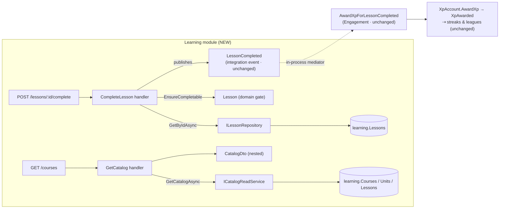
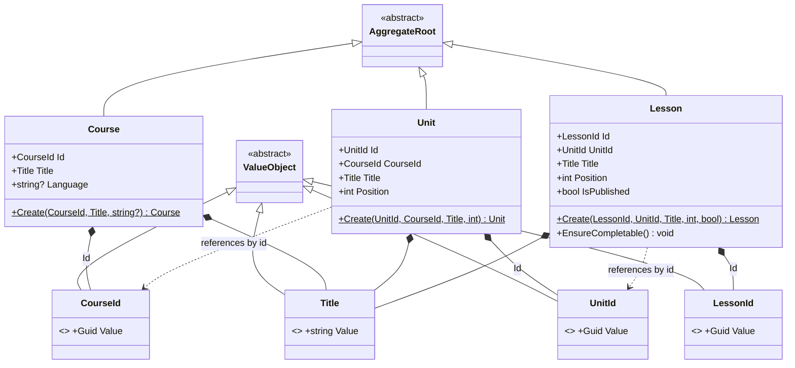

# Sub-project 5 — Learning · Slice 1: Catalog + Real Completion

**Date:** 2026-07-10
**Status:** Approved (design)
**Builds on:** the Architecture Foundations central seam (`LessonCompleted` as Published Language /
Open Host Service) and every tactical pattern established in Engagement — Clean-Architecture layering,
`ValueObject`-based typed ids, aggregate repositories owned by the Domain, EF configurations + a
design-time factory, mediator `INotification` publishing, and the injected `TimeProvider` seam.
**Part of:** **Learning (supporting subdomain)**, decomposed into three slices:
- **Slice 1 (this document):** a real content catalog + validated completion that replaces the stub.
- **Slice 2 (next):** exercise engine + grading — completion becomes *earned* (a passing attempt).
- **Slice 3 (later):** per-learner progress / mastery / unlocking — and the completion economy
  (once-per-lesson, reduced XP on repeat) that this slice deliberately defers.

Original brainstorming visuals archived under [`./diagrams/`](./diagrams/) (prefix `learning-`).

## Goal

Replace `Learning.Stub` with a **real `Learning` module** (Domain · Application · Infrastructure) whose
`LessonCompleted` is emitted from **validated, real content** rather than a fire-and-forget stub.
Slice 1 is the Learning **walking skeleton** — it proves "a real lesson exists → completing it is
validated → the event fires → Engagement awards XP" end-to-end, while keeping the Engagement seam
**completely unchanged**.

Learning is a **supporting** subdomain, so the governing discipline is **restraint**: build it cleanly,
resist the urge to model the full Duolingo content tree, and let the *core* (Engagement) keep the rich
model.

## The mechanic (settled in brainstorming)

The stub does exactly one thing: `CompleteLesson(learnerId, lessonId)` publishes a `LessonCompleted`
with a **random** `EventId`, the **unvalidated** `lessonId`, and `DateTimeOffset.UtcNow`. Any Guid
"completes."

Slice 1 makes that honest. A learner completes a **real** `Lesson` (drawn from a seeded catalog); the
handler loads it, enforces that it is completable, and only then publishes. XP is still decided by
Engagement's own policy — Learning never learns what a lesson is "worth."

## Scope

### In scope (Slice 1)
- A three-aggregate content catalog — **`Course`**, **`Unit`**, **`Lesson`** — each an aggregate root,
  referenced across the tree **by id** (a `Unit` holds a `CourseId`; a `Lesson` holds a `UnitId`).
- A seeded catalog (EF Core `HasData`): one course, two units, four lessons — **one left unpublished**
  so the "not completable" path is exercisable.
- A real **`CompleteLesson`** command (moved into `Learning.Application`): load the `Lesson`, enforce
  `Lesson.EnsureCompletable()`, publish the **unchanged** `LessonCompleted` with `OccurredOn` from the
  injected `TimeProvider`.
- A **`GET /courses`** read model returning the nested catalog, so the skeleton is truly *walking*
  (you can discover a real lesson id, then complete it).
- A new **`Learning` database + `learning` schema** (`DuolingoLearning`, connection
  `ConnectionStrings:Learning`) with its own migrations and design-time factory, mirroring Engagement.
- Deletion of the `Learning.Stub` project; the Host references the real module.

### Out of scope (deferred)
- **Exercises & grading** — Slice 2. In Slice 1 completion is *asserted* (a POST), not *earned*.
- **Per-learner progress / mastery / unlocking** — Slice 3.
- **Completion dedup / "once per lesson" / reduced XP on repeat** — Slice 3 (needs progress state).
  Slice 1 completion is **repeatable**: each POST awards XP again.
- **Authoring APIs** — the catalog is seeded reference data; Slice 1 performs **no runtime writes** to
  the `learning` schema.
- **Deeper hierarchy** (Section, Skill) and **cross-course structure** — YAGNI for a supporting skeleton.
- **A `Course` / `Unit` repository** — only the `Lesson` read path and the catalog read are needed.

## Key design decisions (with rationale)

### 1. Catalog depth — Course → Unit → Lesson (three levels)

A **flat** Course → Lesson catalog is the leanest thing that points at real content, but it gives
Slice 3 nothing on which to hang "unlock the next unit / skill-tree." The **full Duolingo** tree
(Course → Section → Unit → Skill → Lesson) is five aggregates to model, seed, and test — gold-plating a
*supporting* domain. **Course → Unit → Lesson** is the sweet spot: a genuine tree where ordering and
progression are meaningful, still only three entities.

### 2. Aggregate boundaries — three roots, referenced by id (not one `Course` aggregate)

The tell of an aggregate **root** is that it is referenced from *outside* by a **global id**. Lessons
already are: `POST /lessons/{lessonId}/complete` and `LessonCompleted.LessonId`. Modelling `Lesson` as a
mere entity *inside* a `Course` aggregate would contradict how the system addresses it — and would force
the completion handler (which only has a `lessonId`) to first *find and load the entire Course*. Making
each of `Course`, `Unit`, `Lesson` its own root lets completion load exactly one small `Lesson`.

This also matches the house style already chosen for Leagues: **favor small aggregates; reference other
aggregates by identity, never by holding the object.** A `Unit` stores a `CourseId`; a `Lesson` stores a
`UnitId` — plain id value objects, **not** EF navigation properties (a navigation would invite
`lesson.Unit.Course.Title` traversals that silently cross aggregate boundaries).

Rejected alternatives:
- *One `Course` aggregate owning Units → Lessons* — a bounded, seeded catalog makes this defensible, but
  it fights how lessons are addressed and bloats the completion read. (The Leagues "small aggregate"
  reasoning was about write contention; here the deciding factor is **addressability**, not contention.)
- *Two aggregates (`Course`+Units together, `Lesson` alone)* — a legitimate middle ground, but two
  boundary styles to hold in one's head is more than a skeleton needs.

The honest consequence: cross-tree invariants (contiguous ordering, "a lesson's unit exists") are **not
transactionally enforced** across aggregates. That is fine for seeded reference data — content is
authored/seeded, not concurrently mutated — and such invariants can be enforced at authoring time in a
later slice. An optional DB foreign key can still give referential integrity without any navigation.

### 3. Persistence — three tables, one per root, in the `learning` schema

Each aggregate root maps to its own persistent entity: one table + one `IEntityTypeConfiguration<T>` +
one `DbSet<T>`, mirroring `XpAccountConfiguration` et al. `CourseId` / `UnitId` are **id columns**, not
navigations.

Two nuances:
- **Reference by identity = a scalar id column.** No `Unit.Course` navigation.
- **Aggregate ≠ table in general.** Engagement's `XpAccount` is one aggregate across two tables
  (`XpAccounts` + owned `AppliedAwards`). Here each root is a single entity whose only compound members
  are value objects (which map to *columns on the root's table*), so it lands on a clean
  **1 aggregate = 1 table**. That is a property of *this* model, not a law.

### 4. `Lesson.IsPublished` + a domain gate (`EnsureCompletable`)

`Lesson` carries `IsPublished`. Completion validation is a **domain rule**, so it lives in the domain as
`Lesson.EnsureCompletable()` (which throws if the lesson is not completable) — *tell-don't-ask* — rather
than the handler poking a public bool. This gives completion a second, meaningful failure branch (a draft
→ a clean 409) beyond "unknown → 404", and models a genuine content concern (draft vs live) for one
`bool` and one guard.

### 5. Completion is repeatable — a fresh event each time (not a deterministic `SourceId`)

Each `CompleteLesson` publishes a `LessonCompleted` with a **new random `EventId`**, so Engagement
awards XP **every time** — a lesson is a repeatable action (Duolingo "practice"), and this preserves
today's behavior. The `AppliedAward` ledger continues to dedup genuine **redelivery** of the *same*
`EventId` (a no-op in-process today, correct for a future outbox).

The tempting alternative — derive `SourceId = f(learnerId, lessonId)` so the ledger awards XP exactly
once ever — was **rejected**: it smuggles a *business rule* ("only the first completion earns XP") into
the *idempotency mechanism* (whose sole job is "don't process the same event twice"). Conflating them
overloads the ledger with two meanings and blocks a future "reduced XP on repeat" rule. "Once per
lesson" belongs to an explicit **progress** aggregate in **Slice 3**, where per-learner completion
history actually lives — not the dedup key.

Accepted consequence: a double-submit (or a repeat) awards XP twice in Slice 1. That matches current
behavior and is documented; real "complete once" arrives with progress in Slice 3.

### 6. The contract stays XP-free; `OccurredOn` from `TimeProvider`

`LessonCompleted` is **unchanged** — `EventId, LearnerId, LessonId, OccurredOn`. Learning stays ignorant
of XP; Engagement's `LessonCompletionXpPolicy` still decides the amount (seam hygiene — leagues/streaks
keep counting exactly what Engagement awards). The handler stamps `OccurredOn` from the injected
`TimeProvider` (not `DateTimeOffset.UtcNow`), fixing a stub shortcut and keeping the flow testable via
`FakeTimeProvider`.

### 7. Learning writes nothing at runtime (an honest skeleton property)

In Slice 1 `CompleteLesson` only **reads** a `Lesson` (to validate) and publishes an event; the XP write
happens in Engagement's schema. The catalog is seeded once and read thereafter. So Learning's Slice-1
runtime surface is **read-only** — a clean consequence of deferring progress to Slice 3, and the reason
we need no `SaveChanges` on the completion path and no domain-event dispatcher inside Learning
(`LessonCompleted` is an *integration* event published directly via the mediator, exactly as the stub
did).

### 8. Physical isolation — own database *and* own schema

`Learning` gets its **own database** `DuolingoLearning` (`ConnectionStrings:Learning`; design-time
`DuolingoLearning_Design`) **and** its **own schema** `learning` — mirroring Engagement's
`DuolingoEngagement` + `engagement`. These isolate at different levels and are belt-and-suspenders on
purpose: the **schema** is the *logical* module boundary the "one schema per module / no cross-schema
JOIN" rule is written against; the **database** is the *physical* boundary that makes "extract to its own
service later" honest. Because Learning has its own database, cross-module data access would require a
cross-*database* JOIN — even harder than a cross-schema one. The only cross-module link stays the
`LessonCompleted` event.

## The core model

Three small aggregate roots; the only behavior is the completion gate on `Lesson`.

- **`Course`** — `Id: CourseId`, `Title: Title`, `Language: string?`; `Create(...)`.
- **`Unit`** — `Id: UnitId`, `CourseId: CourseId` (id ref), `Title: Title`, `Position: int`; `Create(...)`.
- **`Lesson`** — `Id: LessonId`, `UnitId: UnitId` (id ref), `Title: Title`, `Position: int`,
  `IsPublished: bool`; `Create(...)`; **`EnsureCompletable()`** — throws if `!IsPublished`.

Value objects (inherit `BuildingBlocks.Domain.ValueObject`): `CourseId`, `UnitId`, `LessonId` (Guid
wrappers, non-empty), and a shared **`Title`** (non-empty, trimmed, bounded length). `Position` stays a
plain `int`.

## Data flow

## Tactical model

## Components

### Contracts (`BuildingBlocks.Contracts`)
- **Unchanged.** `LessonCompleted` stays exactly as is (`EventId, LearnerId, LessonId, OccurredOn`).

### Domain (`Learning.Domain`)
- **`Course`**, **`Unit`**, **`Lesson`** aggregate roots (no public setters; `Create` factories).
- **`Lesson.EnsureCompletable()`** — the published gate (throws when not completable).
- **`CourseId`**, **`UnitId`**, **`LessonId`**, **`Title`** value objects.
- **`ILessonRepository`** — read port for the write path: `Task<Lesson?> GetByIdAsync(LessonId, ct)`
  (repository interfaces are Domain-owned).

### Application (`Learning.Application`)
- **`CompleteLesson`** (command) + handler — injects `ILessonRepository`, `IMediator`, `TimeProvider`;
  load-or-throw, `EnsureCompletable()`, publish `LessonCompleted`. No `SaveChanges`.
- **`GetCatalog`** (query) + handler + **`CatalogDto`** (nested `CourseDto → UnitDto → LessonDto`), one
  CQRS slice per file (project convention).
- **`ICatalogReadService`** — read-model port (`Task<CatalogDto> GetCatalogAsync(ct)`), implemented in
  Infrastructure. (A read-model/query port returning a DTO — distinct from the aggregate repository — a
  clean CQRS-lite teaching contrast.)

### Infrastructure (`Learning.Infrastructure`)
- **`LearningDbContext`** — `HasDefaultSchema("learning")`; `DbSet`s for Course/Unit/Lesson.
- **`CourseConfiguration` / `UnitConfiguration` / `LessonConfiguration`** — map each root; typed-id and
  `Title` value converters; **`HasData`** seed. *(Risk to resolve in the plan: `HasData` with
  value-converted keys can be finicky; a small startup seeder is the fallback if it proves awkward.)*
- **`LessonRepository : ILessonRepository`** and **`CatalogReadService : ICatalogReadService`** (an
  ordered projection over the three tables — an intra-schema read, not a cross-module JOIN).
- **`LearningDbContextFactory`** — design-time factory → `DuolingoLearning_Design`.
- **`AddLearningInfrastructure(connectionString)`** DI extension (mirrors `AddEngagementInfrastructure`).
- **Migration `InitialLearning`** — create the three tables + seed.

### Host
- Register `AddLearningInfrastructure(ConnectionStrings:Learning)` and the `Learning.Application` handler
  assembly with the mediator; drop the `Learning.Stub` reference.
- **`POST /lessons/{lessonId:guid}/complete`** — now real: `try` → `SendAsync(CompleteLesson)` → **200**;
  `catch (KeyNotFoundException)` → **404**; `catch (InvalidOperationException)` → **409**. (Follows the
  existing `SetLearnerTimeZone` / `SettleLeagueWeek` try/catch-mapping convention; status moves 202 → 200
  since the XP award runs in-process before the response returns.)
- **`GET /courses`** → `GetCatalog` → `CatalogDto`.
- New `ConnectionStrings:Learning` in `appsettings.json`.

### Removed
- **`Learning.Stub`** project (and its Host project reference).

## Error handling

- **Unknown lesson id** → handler throws `KeyNotFoundException` → endpoint maps to **404**.
- **Unpublished lesson** → `Lesson.EnsureCompletable()` throws `InvalidOperationException` → **409**.
- **Successful completion** → publish `LessonCompleted` → **200**.
- **Repeated completion** → awards XP again (Option A; documented, not an error).
- **`GET /courses`** with an empty catalog → **200** with an empty list (seeding guarantees content in
  practice).
- **Downstream (Engagement) failure** during in-process dispatch → unchanged from today's posture
  (best-effort; no outbox).

## Testing

**Domain (`Learning.Domain.Tests`) — fast, pure:**
- `Title`: rejects empty/whitespace, trims, enforces the length bound.
- Typed ids reject `Guid.Empty`.
- `Lesson.EnsureCompletable()`: no-throw when published; throws when not.
- `Create` factories set fields (including the `CourseId`/`UnitId` id references).

**Integration (`Learning.Integration.Tests`) — isolated DBs (`EnsureDeleted` + `Migrate`), unique names:**
- **Seed/persistence round-trip:** after migration, `CatalogReadService` returns the seeded catalog with
  correct nesting and `Position` ordering; the unpublished lesson is present with `IsPublished == false`.
- **`LessonRepository.GetByIdAsync`:** returns the seeded lesson; `null` for an unknown id.
- **End-to-end (`WebApplicationFactory`, mirroring `StreakApiTests`)** — note the host now provisions
  **two** databases (`DuolingoLearning_E2E` and `DuolingoEngagement_E2E`, both migrated) and disables the
  league scheduler (`Leagues:Settlement:Enabled=false`):
  - `GET /courses` returns the seeded catalog.
  - `POST /lessons/{publishedId}/complete` → **200**, and `GET /me/xp` shows XP increased — proving the
    Learning→Engagement seam still works unchanged.
  - `POST /lessons/{unknownId}/complete` → **404**; `POST /lessons/{unpublishedId}/complete` → **409**.
  - Completing a published lesson **twice** awards XP **twice** (Option A / repeatable).

**Architecture (`Learning.Integration.Tests/Architecture`, NetArchTest — mirrors Engagement):**
- `Learning.Domain` references nothing infrastructural (no EF Core, no ASP.NET).
- `Learning.*` holds **no reference to `Engagement.*` types** (cross-module isolation); modules talk only
  via `BuildingBlocks.Contracts` + the mediator.

**Test migration (the stub's own tests necessarily change — this is expected, not a regression):**
Making completion *real* replaces the stub's "any guid completes with 202" behavior, so the tests that
encoded it must move or update. Streak/league suites are untouched (they publish `LessonCompleted`
directly).
- **`EngagementApiFactory`** now boots the real Learning module, so it must provide
  `ConnectionStrings:Learning` and provision the `DuolingoLearning_E2E` database (and keep disabling the
  league scheduler, as today). The new `Learning.Integration.Tests` e2e factory provisions both DBs.
- **`EngagementApiTests.Completing_a_lesson_then_reading_engagement_shows_ten_xp`** (posts a *random*
  guid, expects 202) is **superseded** by the Learning e2e test (complete a *real seeded published*
  lesson → 200 → `GET /me/xp` reflects the award) and is removed from the Engagement suite.
- **`CompleteLessonHandlerTests`** (currently `Engagement.Integration.Tests/Learning/`, `using
  Learning.Stub`) **moves to `Learning.Integration.Tests`** and is rewritten against the new handler
  (`ILessonRepository` + `TimeProvider`): publishes `LessonCompleted` for a published lesson; throws for
  unpublished and for unknown.
- **Unchanged:** `EngagementApiTests.Same_lesson_completed_event_delivered_twice_awards_once`,
  `EngagementApplicationTests`, `LessonCompletedTests`, and all streak/league tests (they construct or
  publish `LessonCompleted` directly, never through the completion endpoint).

## Acceptance criteria

1. Completing a **published, existing** lesson publishes an unchanged `LessonCompleted` and results in an
   XP award (verified via `GET /me/xp`) — the Engagement seam is untouched.
2. Completing an **unknown** lesson returns **404**; completing an **unpublished** lesson returns **409**.
3. Completing the same lesson **twice** awards XP twice (repeatable; dedup deferred to Slice 3).
4. `GET /courses` returns the seeded catalog nested Course → Unit → Lesson, ordered by `Position`.
5. `LessonCompleted` is **unchanged / XP-free**; `OccurredOn` comes from the injected `TimeProvider`.
6. Learning persists to its **own `DuolingoLearning` database + `learning` schema** with its own
   migration; no cross-module type references and no cross-database access (only the event).
7. `Learning.Stub` is deleted and the Host runs the real module. **Streak and league suites pass
   unchanged** (they publish `LessonCompleted` directly). The two stub-coupled Engagement tests and the
   e2e factory are updated to the real completion behavior (see *Testing → Test migration*).
8. `Learning.Domain` references nothing infrastructural (architecture test).

## What Slices 2 & 3 inherit

- **Slice 2 (grading):** `Lesson` gains **exercises**; completion is driven by a **passing attempt**
  (an `Attempt` aggregate + a grading domain service), and `LessonCompleted` fires only on a pass —
  replacing Slice 1's asserted completion. The catalog and the seam are already real.
- **Slice 3 (progress):** per-learner **progress / mastery / unlocking** ("next lesson," skill-tree
  traversal), and with it the **completion economy** — once-per-lesson credit and reduced XP on repeat —
  modelled explicitly where completion history lives, rather than in the idempotency key.
