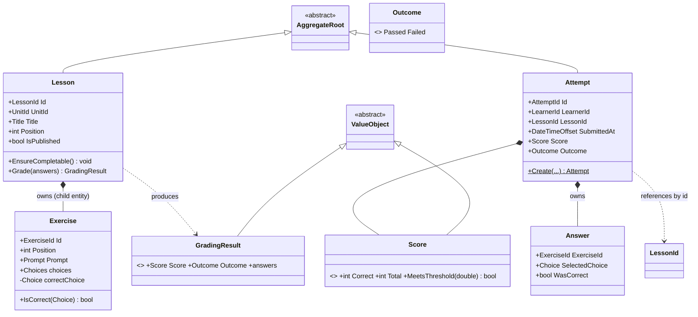
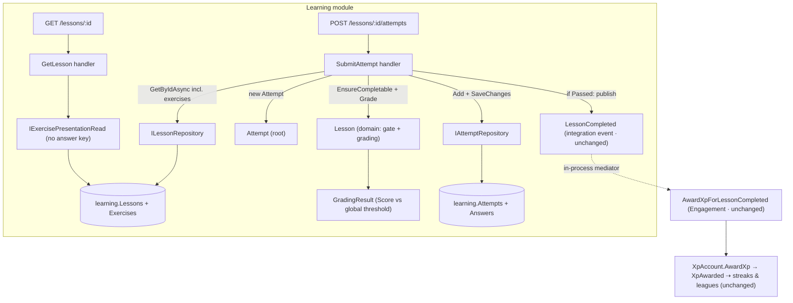

# Sub-project 5 — Learning · Slice 2: Exercises + Grading (earned completion)

**Date:** 2026-07-21
**Status:** Approved (design)
**Builds on:** [Slice 1 — Catalog + Real Completion](./2026-07-10-learning-catalog-completion-design.md).
Slice 1 made a `Lesson` real and completion *validated*; Slice 2 makes completion **earned**. It reuses
every tactical pattern already in Learning — `ValueObject`-based typed ids, aggregate repositories owned
by the Domain, EF configurations + a design-time factory, mediator `INotification` publishing, and the
injected `TimeProvider` seam — and keeps the Engagement seam (`LessonCompleted`) **completely unchanged**.
**Part of:** **Learning (supporting subdomain)**, three slices:
- **Slice 1 (done):** a real content catalog + validated completion.
- **Slice 2 (this document):** exercise engine + grading — completion becomes *earned* via a passing attempt.
- **Slice 3 (later):** per-learner progress / mastery / unlocking + the completion economy
  (once-per-lesson credit, reduced XP on repeat, dedup).

Original brainstorming visuals archived under [`./diagrams/`](./diagrams/) (prefix `learning-s2-`).

## Product context

The front end is a **2D tile/overworld map** (a knight walking a path; lessons are nodes along it).
That framing mostly informs **Slice 3** (which node is *reachable*/unlocked) and the future Angular
client. Its only Slice-2 consequence is a **read to present a lesson's exercises** (tapping a node shows
its questions), which this slice adds as `GET /lessons/{id}`.

## Goal

Replace Slice 1's *asserted* completion (a bare `POST /complete` that any published lesson accepts) with
**earned** completion: a learner submits answers to a lesson's exercises, the server grades them
server-authoritatively, records the graded **`Attempt`**, and publishes the unchanged `LessonCompleted`
**only on a pass**. This is the Learning module's **first runtime write path**.

Learning is a **supporting** subdomain, so the governing discipline remains **restraint**: one exercise
type, a single grading rule, the leanest model that makes grading genuinely real — with seams drawn so
richer variants are *additive* later, not rework.

## The mechanic (settled in brainstorming)

`POST /lessons/{id}/attempts { answers: [ {exerciseId, choice}, … ] }` →
load the `Lesson` (with its exercises) → `EnsureCompletable()` → validate the answer set → `Lesson.Grade`
produces a `GradingResult` (a `Score` compared against a **global** pass threshold) → construct an
already-graded `Attempt` → `SaveChanges` (persist every attempt, pass **or** fail) → **only on a pass**
publish `LessonCompleted` → `200` with `{ attemptId, score, outcome, perExercise[] }`.

## Scope

### In scope (Slice 2)
- **One exercise type — multiple-choice** — modelled as a child **`Exercise`** entity *inside* the
  `Lesson` aggregate (`prompt`, `choices[]`, `correctChoice`), with the answer key sealed behind
  `Exercise.IsCorrect(choice)`.
- **`Lesson.Grade(answers) → GradingResult`** — grading behaviour on the aggregate that owns every input
  (exercises, keys, threshold). Rejects malformed answer sets.
- A **`Score`** value object (correct/total as a percentage) owning **`MeetsThreshold(threshold)`**, a
  **global** `PassThreshold` domain constant, an **`Outcome`** enum (`Passed`/`Failed`), and a
  **`GradingResult`** carrying score + outcome + per-exercise correctness.
- A new persisted **`Attempt`** aggregate root (`LearnerId`, `LessonId` by id, owned `Answers[]`, `Score`,
  `Outcome`, `SubmittedAt`) — Learning's **first write path**: `IAttemptRepository.Add` + `SaveChanges`.
- **`POST /lessons/{id}/attempts`** (a `SubmitAttempt` command + handler) — grades, persists, publishes on
  a pass. **Replaces** Slice-1 `POST /lessons/{id}/complete` and the `CompleteLesson` command.
- **`GET /lessons/{id}`** — a read model presenting the lesson's exercises (prompt + choices, **no answer
  key**) for the map node-tap view.
- Seed extended (EF `HasData`) with multiple-choice exercises on the published lessons; a new migration
  `AddExercisesAndAttempts`. The unpublished lesson stays exercise-light to keep the 409 path exercisable.

### Out of scope (deferred)
- **Multiple exercise types** (translate, listen-and-type, match…) — the `Exercise`/`IsCorrect`
  polymorphism seam is drawn, but Slice 2 ships one concrete type.
- **Per-learner progress / mastery / unlocking** — Slice 3 (the 2D-map "which node is reachable").
- **Completion economy** — once-per-lesson credit, reduced XP on repeat, dedup — Slice 3 (needs progress).
  Slice 2 completion stays **repeatable**: each passing attempt awards XP again.
- **Interactive per-exercise session + hearts/mistake budget** — the attempt is an atomic batch.
- **Attempt history read endpoints** — attempts are persisted now, surfaced later.
- **Authoring APIs** — content stays seeded reference data.

## Key design decisions (with rationale)

### 1. One exercise type now — multiple-choice — polymorphism-ready
A single well-modelled type teaches the earned-completion mechanic, the `Attempt` aggregate, and
server-authoritative grading without gold-plating a *supporting* domain. The per-type grading difference
(choice-equality vs normalized string match) belongs on the `Exercise` subtype's `IsCorrect` override, so
a second type is an **additive** change: no rework of `Attempt`, `Lesson.Grade`, or the flow. The
open/closed payoff is *banked*, not spent.

### 2. `Exercise` is a child entity inside the `Lesson` aggregate (not its own root)
Slice 1's **addressability** test cuts the other way here: nobody addresses an exercise by a global id
(`GET /exercises/{id}` is meaningless) — exercises are only ever reached *through* their lesson. That is
the definition of a child entity, not a root. So `Lesson` finally grows a child collection and becomes the
codebase's first **1 aggregate → 2 tables** content root (mirroring Engagement's `XpAccount` + owned
`AppliedAwards`; Slice 1 noted "1 aggregate = 1 table" was a property of *that* model, not a law).

Decisive secondary reason: **where the correct answer is allowed to exist.** Grading must be
server-authoritative, so the answer key must never reach a DTO. As a child *inside* the boundary, sealed
behind `Exercise.IsCorrect(choice)`, the key has a home a read model structurally cannot reach. A separate
`Exercise` root would scatter the key across a standalone table and invite "load exercises separately"
reads the aggregate otherwise prevents.

### 3. Grading lives on `Lesson.Grade(answers)` — not (yet) a domain service
Grading needs three inputs — the exercises, their correct answers, and the pass threshold — **all owned by
`Lesson`** — and produces a `Score`/`Outcome`. Putting the behaviour on the aggregate that owns every input
avoids an anemic one-method service. Crucially, the future complexity we can foresee (more exercise types)
lands on `Exercise.IsCorrect` **polymorphism**, *not* on the grading orchestrator — so a `GradingService`
extracted now would risk staying a thin loop forever.

The spec-named `GradingService` domain service is therefore **deferred with a documented trigger**: extract
`Lesson.Grade` → `GradingService` the day a grading rule appears that spans **beyond a single lesson's own
data** (partial credit, exercise weighting, adaptive scoring, grading that reads learner history). Because
`GradingResult` (a value object) is already the stable seam, that extraction is a mechanical, safe refactor.
We still build the domain-service muscle later — when it is load-bearing rather than ceremonial.

### 4. `Score` is a value object; the pass threshold is a global constant
`Score` (correct/total as a percentage) owns the pass rule via `MeetsThreshold(threshold)` — a meaningful
value object rather than a bare number or bool. The **threshold is a single global domain constant**
(e.g. `0.8`), not a per-lesson field: one place to change, and the grading rule stays in the domain.
`Lesson.Grade` computes the `Score`, then sets `Outcome = Score.MeetsThreshold(PassThreshold) ? Passed :
Failed`.

### 5. The `Attempt` is a persisted aggregate root — Learning's first write path
A never-persisted "aggregate" is a contradiction — aggregates *are* consistency/persistence boundaries.
Persisting **every** attempt (pass or fail) is the honest first write path and produces exactly the
durable history Slice 3's completion economy reads (repeats, pass rate, "once per lesson"). The transient
alternative (grade in memory, write nothing, keep Learning read-only) was rejected: it collapses the
`Attempt` back to a value object and forces Slice 3 to build the write path *and* backfill history it never
captured. The cost of persisting now is modest — one child table, one root table, one repository, one
migration — a skeleton growing its spine, not gold-plating.

### 6. Atomic batch attempt (whole-lesson), not an interactive session
One `Attempt` = one complete pass through the lesson's exercises, graded as a unit in a single transaction
and a single endpoint. The per-exercise interactive flavour (instant feedback, hearts/mistake budget,
resumable session) is more Duolingo-authentic but drags in attempt-session state, partial persistence,
resumption, and a mistakes economy — too much surface for a supporting module, and largely a *frontend*
concern with no client yet.

### 7. Event timing — publish only on a pass, after `SaveChanges`, no dispatcher
The persisted `Attempt` is the source of truth; `LessonCompleted` is published **after** the commit and
**only** when `Outcome == Passed`. The in-process XP award stays best-effort (same no-outbox posture as
Slice 1 — a future outbox could re-publish from the saved row). `LessonCompleted` is an **integration**
event the handler publishes **directly** via the mediator — Learning gains **no** domain-event dispatcher
(aggregates raise domain events; the application layer publishes integration events). Completion stays
**repeatable**: each passing attempt awards XP again; true "once per lesson" is Slice 3.

### 8. The contract stays XP-free / unchanged; `OccurredOn` from `TimeProvider`
`LessonCompleted` is **unchanged** (`EventId, LearnerId, LessonId, OccurredOn`). Learning stays ignorant of
XP; Engagement's `LessonCompletionXpPolicy` still decides the amount (streaks/leagues keep counting exactly
what Engagement awards). `OccurredOn` and `Attempt.SubmittedAt` come from the injected `TimeProvider`.

## The core model

`PassThreshold` is a **global domain constant**. Value objects (inherit `BuildingBlocks.Domain.ValueObject`):
`Score`, `GradingResult`, `Prompt`, new typed ids `ExerciseId` / `AttemptId`, reuse of `Title`. `Position`
and `Outcome` are a plain `int` / enum.

## Data flow

## Components

### Contracts (`BuildingBlocks.Contracts`)
- **Unchanged.** `LessonCompleted` stays `EventId, LearnerId, LessonId, OccurredOn`.

### Domain (`Learning.Domain`)
- **`Lesson`** grows an owned `Exercise` collection, **`Grade(answers)`**, and keeps `EnsureCompletable()`.
- **`Exercise`** child entity — `Prompt`, `Choices`, hidden `correctChoice`, **`IsCorrect(choice)`**.
- **`Attempt`** aggregate root (+ owned `Answer`) — `Create(learnerId, lessonId, submittedAt, gradingResult)`.
- Value objects: **`Score`** (`MeetsThreshold`), **`GradingResult`**, **`Prompt`**, **`ExerciseId`**,
  **`AttemptId`**; **`Outcome`** enum; **`PassThreshold`** constant.
- **`IAttemptRepository`** — `Task Add(Attempt, ct)` (Domain-owned write port). `ILessonRepository`
  unchanged in shape; its implementation now eager-loads exercises.

### Application (`Learning.Application`)
- **`SubmitAttempt`** (command) + handler — load lesson (or 404), `EnsureCompletable()` (or 409),
  `Lesson.Grade` (or 400 on a malformed set), build `Attempt`, `Add` + `SaveChanges`, publish
  `LessonCompleted` **only on Passed**; returns a result DTO. **Replaces `CompleteLesson`.**
- **`GetLesson`** (query) + handler + **`LessonView` DTO** (exercises with prompt + choices, **no key**).
- **`IExercisePresentationRead`** — read-model port for `GetLesson`.

### Infrastructure (`Learning.Infrastructure`)
- **`LearningDbContext`** — add `DbSet<Attempt>`; the `Exercise` collection maps as an owned/child table.
- **`ExerciseConfiguration`** (child of Lesson) + **`AttemptConfiguration`** (+ owned `Answer`); typed-id
  and value converters; **`HasData`** extended with multiple-choice exercises.
- **`LessonRepository`** — `GetByIdAsync` now `Include`s exercises.
- **`AttemptRepository : IAttemptRepository`**; **`ExercisePresentationRead : IExercisePresentationRead`**.
- **Migration `AddExercisesAndAttempts`** — create `Exercises` + `Attempts` (+ `Answers`) tables + seed.

### Host
- **`POST /lessons/{id:guid}/attempts`** → `SubmitAttempt`: `200` (Passed/Failed);
  `catch (KeyNotFoundException)` → **404**; `catch (InvalidOperationException)` → **409**;
  `catch (ArgumentException)` (malformed answer set) → **400**.
- **`GET /lessons/{id:guid}`** → `GetLesson` → `LessonView`.
- **Remove** `POST /lessons/{id}/complete`.

### Removed
- `POST /lessons/{id}/complete` endpoint and the `CompleteLesson` command/handler.

## Error handling

| Case | Where decided | Response |
|---|---|---|
| Unknown lesson id | handler → `KeyNotFoundException` | **404** |
| Unpublished lesson | `Lesson.EnsureCompletable()` throws `InvalidOperationException` | **409** |
| Answer set doesn't match the lesson's exercises (missing / unknown / invalid choice) | `Lesson.Grade` domain guard → `ArgumentException` | **400** |
| Graded — passed | publish `LessonCompleted` → XP | **200** `Passed` |
| Graded — failed | no event | **200** `Failed` |
| Repeat passing attempt | awards XP again (repeatable; dedup → Slice 3) | **200** |
| `GET /lessons/{id}` unknown | `KeyNotFoundException` | **404** |
| Downstream (Engagement) failure during in-process dispatch | attempt already persisted; best-effort, no outbox | attempt saved |

## Testing

**Domain (`Learning.Domain.Tests`) — fast, pure:**
- `Score`: percentage math; `MeetsThreshold` boundary (**exactly at** threshold passes); rejects
  `correct > total` / negatives.
- `Exercise.IsCorrect`: true for the correct choice, false otherwise; key never exposed.
- `Lesson.Grade`: all-correct → `Passed`; below → `Failed`; at-threshold → `Passed`; per-exercise
  correctness recorded; **rejects** malformed answer sets (missing / unknown exercise).
- `Lesson.EnsureCompletable`: unchanged gate (published no-throw; unpublished throws).
- `Attempt.Create`: records answers, score, outcome, learner, lessonId, `SubmittedAt`; `WasCorrect` per answer.

**Integration (`Learning.Integration.Tests`) — isolated DBs (`EnsureDeleted` + `Migrate`), unique names:**
- Exercises round-trip: `GetByIdAsync` eager-loads exercises incl. `correctChoice`; the presentation read
  **omits** the key.
- `Attempt` + owned `Answers` round-trip: `Add` + `SaveChanges` persists; reload matches.
- **End-to-end (`WebApplicationFactory`, two DBs, league scheduler disabled):**
  - `GET /lessons/{id}` returns exercises **without** the correct answer.
  - `POST /lessons/{id}/attempts` with passing answers → **200** `Passed`, and `GET /me/xp` increased
    (Learning→Engagement seam still works).
  - Failing answers → **200** `Failed`, XP unchanged, attempt persisted.
  - Unpublished → **409**; unknown → **404**; malformed answer set → **400**.
  - Passing **twice** awards XP **twice** (repeatable).

**Architecture (`Learning.Integration.Tests/Architecture`, NetArchTest — unchanged):**
- `Learning.Domain` references nothing infrastructural.
- `Learning.*` holds no reference to `Engagement.*` types.

**Test migration (expected, not a regression):**
- Slice-1's `POST /complete` e2e (complete a seeded published lesson → 200 → XP) is **superseded** by the
  passing-attempt e2e above and removed/rewritten.
- **`CompleteLessonHandlerTests` → `SubmitAttemptHandlerTests`**, rewritten against the new handler
  (grades a published lesson; 409 unpublished; 404 unknown; 400 malformed; publishes only on a pass).
- **Unchanged:** streak/league suites and `Same_lesson_completed_event_delivered_twice_awards_once` — they
  construct/publish `LessonCompleted` directly, never through the completion endpoint.

## Acceptance criteria

1. Submitting a **passing** set of answers to a **published** lesson persists an `Attempt` (`Passed`) and
   publishes the unchanged `LessonCompleted`, and `GET /me/xp` reflects the award — the Engagement seam is
   untouched.
2. Submitting a **failing** set returns **200** `Failed`, persists the `Attempt`, and publishes **no** event
   (XP unchanged).
3. Submitting to an **unknown** lesson → **404**; to an **unpublished** lesson → **409**; a **malformed**
   answer set → **400**.
4. Grading is **server-authoritative**: `GET /lessons/{id}` never returns the correct answer; the key exists
   only inside the `Lesson` aggregate.
5. Passing the same lesson **twice** awards XP **twice** (repeatable; dedup deferred to Slice 3).
6. `Score` is a value object owning `MeetsThreshold`; the pass threshold is a single **global** domain
   constant; `LessonCompleted` is **unchanged / XP-free**; `SubmittedAt`/`OccurredOn` come from the injected
   `TimeProvider`.
7. `Attempt` persists to the **`learning` schema** (`DuolingoLearning`) via a new migration; no cross-module
   type references and no cross-database access (only the event).
8. `Learning.Domain` references nothing infrastructural (architecture test). `POST /complete` and
   `CompleteLesson` are removed; the Host exposes `POST /lessons/{id}/attempts` and `GET /lessons/{id}`.

## What Slice 3 inherits

- **Progress / mastery / unlocking** — the 2D-map "which node is reachable" traversal, built on the
  persisted `Attempt` history this slice captures.
- **The completion economy** — once-per-lesson credit and reduced XP on repeat, modelled explicitly where
  completion history lives (not in the idempotency key).
- **`GradingService` extraction** — when a grading rule spans beyond a single lesson's own data
  (`GradingResult` is the stable seam).
- **Additional exercise types** — additive `Exercise` subtypes overriding `IsCorrect`.
