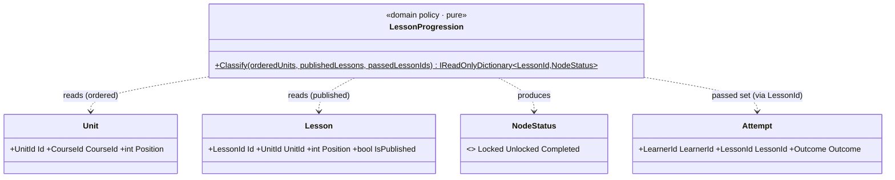
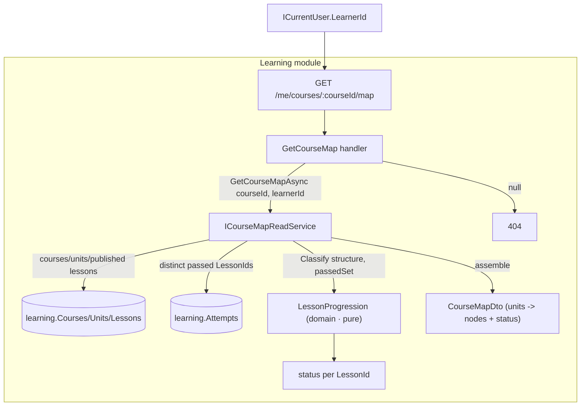

# Sub-project 5 — Learning · Slice 3a: Progress & Unlocking (read-only progression)

**Date:** 2026-07-21
**Status:** Approved (design)
**Builds on:** [Slice 2 — Exercises + Grading](./2026-07-21-learning-slice2-exercises-grading-design.md).
Slice 2 made completion *earned* and persisted every `Attempt` (pass or fail) "so Slice 3's completion
economy reads repeats, pass rate, once-per-lesson." Slice 3a spends exactly that dividend: it derives a
per-learner **course map** — which lesson node is Completed / Unlocked / Locked — as a **read-only
projection over the attempt history that already exists**. No new write path, no migration.

## Part-of / decomposition

The CLAUDE.md "Next" note bundled Slice 3 as *"per-learner progress / mastery / unlocking + the completion
economy (once-per-lesson credit, reduced XP on repeat, dedup)."* Those are **two distinct subsystems**:

- **Progress / unlocking** — Learning-**internal**, read-only: the 2D-map "which node is reachable."
- **The completion economy** — **cross-module** and contract-touching: reduced XP on repeat is an
  *Engagement* award decision, likely changing `LessonCompleted` or Engagement's award policy.

We deliberately **split** them (approved in brainstorming). This slice ships progress/unlocking only; the
**completion economy becomes Slice 4**. Rationale: the progression projection is the natural place the
economy will later read "have they completed this lesson before?", so building it first gives Slice 4 a
home — and it isolates the cross-module XP change into its own PR.

## Product context

The front end is a **2D tile/overworld map** (a knight walking a path; lessons are nodes along it). This
slice is the "which node is *reachable*" half of that framing — the server-authoritative answer to what the
map should render as walkable, walked, or still fogged. There is no Angular client yet, so the deliverable
is the **read endpoint** that a client would call: `GET /me/courses/{courseId}/map`.

## Goal

Given a learner and a course, return each **published** lesson node's progression status —
**Completed / Unlocked / Locked** — computed by applying an unlock rule to the learner's passing-attempt
history and the course's ordered structure. The interesting logic (the unlock rule) is a **pure domain
policy**; everything else is a thin read path.

Learning is a **supporting** subdomain, so the governing discipline remains **restraint**: no new
aggregate, no second source of truth for "did they pass this lesson" (the `Attempt` history already is
that), no mastery/crown-levels, no unlock *enforcement*. The leanest projection that makes the map real,
with the rule modeled richly enough to unit-test.

## The mechanic (settled in brainstorming)

`GET /me/courses/{courseId}/map` →
resolve the current `LearnerId` (Host `ICurrentUser`) → load the course's ordered units + its **published**
lessons + the learner's **distinct passed `LessonId`s** (from `learning.Attempts`) → feed both into the
domain policy `LessonProgression.Classify(...)` → assemble a `CourseMapDto` of units → lesson nodes, each
carrying a `Status` → `200`. Unknown course → `404`.

## The unlock rule (Rule A — linear within a unit, sequential units)

A **published** lesson node is exactly one of:

- **Completed** — the learner has **≥ 1 passing `Attempt`** for that lesson. (A passing attempt always
  wins, even if reached "out of order"; a failing attempt does **not** complete.)
- **Unlocked** (the *frontier*) — not Completed, **and** every published lesson *preceding* it in the
  course order is Completed. Course order is `Unit.Position`, then `Lesson.Position`. Equivalently, with
  **unit gating**: a unit "opens" only once every published lesson in **all prior units** is Completed, and
  within an open unit lessons unlock **sequentially**. The first lesson of the first unit is Unlocked from
  the start (nothing precedes it).
- **Locked** — otherwise.

### Rule details / edge cases (each a domain test)
- **Drafts are invisible.** `IsPublished == false` lessons are **not nodes** and take **no part** in
  ordering or gating — a draft in the middle of a unit does **not** wedge the path. (Resolves the
  "draft-lesson visibility" follow-up the Slice-2 spec flagged.) Consequence: the attempt endpoint still
  returns **409** for a draft hit directly, but a draft can never block downstream unlocks on the map.
- **Out-of-order pass.** If a learner passes a lesson whose predecessors aren't done (possible today —
  the attempt endpoint gates only on *published*, not on *unlocked*), that lesson is **Completed**, but its
  being passed does **not** leak unlocks to lessons whose *own* predecessors remain incomplete.
- **Vacuously-complete unit.** A unit with **zero published lessons** is vacuously complete and therefore
  **opens the next unit**. Such a unit contributes no nodes and is **omitted** from the map payload.
- **Empty course** (no units / no published lessons) → an empty `Units` list.

> Note: for straight, in-order play Rule A and a purely-flattened frontier coincide; the unit-gating
> articulation is the clearer domain statement and is where the out-of-order / empty-unit cases are decided.

## Scope

### In scope (Slice 3a)
- **`NodeStatus`** domain enum: `Locked`, `Unlocked`, `Completed`.
- **`LessonProgression`** — a **pure, framework-free domain policy** encoding Rule A:
  `Classify(orderedUnits, publishedLessons, passedLessonIds) → IReadOnlyDictionary<LessonId, NodeStatus>`.
  This is the slice's center of gravity and its richest unit-test target.
- **`GetCourseMap(CourseId, LearnerId)`** query + handler (returns `null` on unknown course).
- **DTOs:** `CourseMapDto(CourseId, Title, Units)` → `UnitMapDto(Id, Title, Position, Lessons)` →
  `LessonNodeDto(Id, Title, Position, string Status)`. Status is a **string** on the wire
  (`"Completed"|"Unlocked"|"Locked"`) so the contract doesn't bind to the enum's ordering.
- **`ICourseMapReadService`** read port (Application) + **`CourseMapReadService`** (Infrastructure):
  materialize course + units + published lessons + the learner's distinct passed `LessonId`s (in-memory
  assembly, mirroring `CatalogReadService`), call the domain policy, build the DTO; return `null` on unknown
  course.
- **Host:** `GET /me/courses/{courseId:guid}/map` → `ICurrentUser.LearnerId` + `GetCourseMap`;
  `dto is null` → **404** (the nullable-DTO read convention, matching the existing `GetLesson` endpoint —
  not an exception; see decision 6 below).

### Out of scope (deferred)
- **`LearnerProgress` aggregate / any new write state or migration.** The completed set already lives in
  `learning.Attempts`; a second source of truth is exactly the gold-plating a supporting subdomain resists.
  It earns its place the day **mastery** means state beyond attempt history (crown levels, repetition
  counts, decay) — with the completion economy, in Slice 4.
- **Mastery / crown levels.** In a pass/fail projection "mastered" collapses into **Completed**; no distinct
  concept this slice.
- **The completion economy** — once-per-lesson credit, reduced XP on repeat, dedup — **Slice 4**
  (cross-module; this projection is what it will read).
- **Unlock *enforcement*.** The map *advises*; `POST /lessons/{id}/attempts` still gates only on
  `IsPublished`. Refusing an attempt on a Locked lesson is a later concern.
- **Attempt-history read endpoints, authoring APIs.** Unchanged from Slice 2.

## Key design decisions (with rationale)

### 1. Read-only projection over `Attempt` history — no new aggregate
Slice 2 persisted every attempt *precisely* so progress could be derived. Introducing a `LearnerProgress`
aggregate now would create a **second source of truth** for "did they pass this lesson," which `Attempt`
already answers — duplication a **supporting** subdomain should refuse. This mirrors the repo's
"defer-until-load-bearing" discipline (cf. the deferred `GradingService`): the aggregate arrives when
mastery needs durable state the attempt log can't express, not before. The cost paid now is one read
service and one endpoint; the aggregate, a migration, and event wiring are all avoided.

### 2. The unlock rule is domain logic — a pure `LessonProgression` policy
Even though the *state* is derived, "which node is reachable" is a genuine **business rule**, so it lives in
`Learning.Domain`, framework-free, as a pure function of (ordered structure, passed set). That keeps the
one interesting thing in this slice **fast-unit-testable in isolation** — the whole point of the exercise —
and keeps Infrastructure a dumb fetch-and-assemble. (It coincidentally sets up an eventual
`ProgressionPolicy`-style seam if branching paths/prerequisites ever arrive.)

### 3. Rule A (linear-in-unit, sequential-units) over a flat frontier or a prerequisite DAG
Rule A is the authentic Duolingo unit-map model and gives a real rule to encode (frontier + unit gating +
out-of-order/empty-unit handling). A purely flat frontier (Option B) is behaviorally near-identical for
in-order play but *too* thin to model much; an explicit prerequisite DAG (Option C) is gold-plating unless
we actually want branching paths — which the "path" framing doesn't need. So Rule A: richest teachable
rule that still fits a supporting subdomain.

### 4. Drafts don't participate in progression
A draft a learner *cannot pass* (409) must never sit in the completion chain, or it would **permanently
block** every downstream lesson. So the map is computed over **published lessons only**; drafts are neither
nodes nor gates. This keeps the existing 409-on-draft behavior intact while making the map robust, and
closes the Slice-2 "draft-lesson visibility" follow-up.

### 5. Per-course endpoint, status as a string
`GET /me/courses/{courseId}/map` (per course) matches the "2D map for a course" framing and the existing
per-course catalog shape, rather than a single global `GET /me/progress`. `Status` serializes as a
**string** so the wire contract is stable regardless of enum ordering and needs no global
`JsonStringEnumConverter` assumption.

### 6. Infrastructure may call the domain policy
`CourseMapReadService` (Infrastructure) calls `LessonProgression.Classify` directly. This respects the
Dependency Rule — Infrastructure → Domain is inward — and keeps the read path a single cohesive
fetch → classify → assemble unit, exactly as `CatalogReadService` already assembles a DTO in one place. The
handler stays thin (a pass-through delegate); `null` propagates all the way to the Host endpoint, which maps
it to **404** — the **nullable-DTO read convention** already established by `GetLesson`, adopted here
instead of this doc's original `KeyNotFoundException` sketch (settled in the implementation plan, since it
avoids exceptions-as-control-flow and keeps every Learning read endpoint consistent).

## The core model

`LessonProgression` is stateless (a pure function over inputs). No new value objects, no new aggregate, no
schema change. Existing typed ids (`LessonId`, `UnitId`, `CourseId`, `LearnerId`) and the `Outcome` enum are
reused as-is.

## Data flow

No integration events, no cross-module calls, no writes.

## Components

### Contracts (`BuildingBlocks.Contracts`)
- **Unchanged.** No events involved.

### Domain (`Learning.Domain`)
- **`NodeStatus`** enum — `Locked`, `Unlocked`, `Completed`.
- **`LessonProgression`** — pure policy: `Classify(IReadOnlyList<Unit> unitsInOrder,
  IReadOnlyList<Lesson> publishedLessons, IReadOnlySet<LessonId> passedLessonIds)
  → IReadOnlyDictionary<LessonId, NodeStatus>`. Encodes Rule A incl. drafts-absent (caller passes published
  only), out-of-order pass, vacuous-empty-unit. References nothing infrastructural.

### Application (`Learning.Application`)
- **`GetCourseMap(Guid CourseId, Guid LearnerId) : IRequest<CourseMapDto?>`** + **`GetCourseMapHandler`**
  (a thin pass-through to the read service; `null` propagates to the Host, which maps it to 404).
- **DTOs:** `CourseMapDto(Guid CourseId, string Title, IReadOnlyList<UnitMapDto> Units)`;
  `UnitMapDto(Guid Id, string Title, int Position, IReadOnlyList<LessonNodeDto> Lessons)`;
  `LessonNodeDto(Guid Id, string Title, int Position, string Status)`.
- **`ICourseMapReadService`** — `Task<CourseMapDto?> GetCourseMapAsync(Guid courseId, Guid learnerId, CancellationToken ct)`.

### Infrastructure (`Learning.Infrastructure`)
- **`CourseMapReadService : ICourseMapReadService`** — materialize the course (or `null`), its ordered units,
  its published lessons, and the learner's **distinct passed `LessonId`s** from `Attempts`
  (`Outcome == Passed`, deduped in memory to avoid value-converter translation limits); call
  `LessonProgression.Classify`; assemble the DTO (units in `Position` order, each with its published lessons
  in `Position` order carrying `Status.ToString()`; omit units with no published lessons).

### Host
- **`GET /me/courses/{courseId:guid}/map`** → `new GetCourseMap(courseId, currentUser.LearnerId)`;
  `dto is null` → **404**; else **200** with `CourseMapDto`.

### Removed / changed
- **Nothing removed.** `POST /lessons/{id}/attempts`, `GET /lessons/{id}`, `GET /courses`, and every
  Engagement path are untouched. No migration.

## Error handling

| Case | Where decided | Response |
|---|---|---|
| Known course, any learner | read service returns a DTO | **200** `CourseMapDto` |
| Unknown course id | read service returns `null` → Host maps `null` to 404 | **404** |
| Learner with no attempts | passed set empty → first published lesson Unlocked, rest Locked | **200** |
| Draft lesson | excluded from nodes and from gating | not shown |
| Failing-only attempts on a lesson | not in passed set → lesson not Completed | **200** |

## Testing

**Domain (`Learning.Domain.Tests`) — fast, pure (`LessonProgression`):**
- Empty course (no units / no published lessons) → empty result.
- Nothing passed → first lesson **Unlocked**, all others **Locked**.
- Pass the first lesson → it is **Completed**, the second is **Unlocked**, the rest **Locked**.
- Complete every published lesson of unit 1 → unit 2's first lesson becomes **Unlocked**.
- Partially complete unit 1 → unit 2's lessons stay **Locked**.
- Out-of-order pass (a later lesson passed while a predecessor isn't) → that lesson **Completed**, but the
  earliest incomplete lesson is the only **Unlocked** one (no leaked unlocks).
- A unit with zero published lessons is vacuously complete → the next unit opens.

**Integration (`Learning.Integration.Tests`) — isolated DBs (`EnsureDeleted` + `Migrate`), unique names:**
- `CourseMapReadService` over a seeded DB for a learner with known attempts → statuses correct; **draft
  lesson absent** from nodes; only **passing** attempts count (a failing attempt leaves the lesson
  Unlocked/Locked, not Completed); duplicate passing attempts collapse to one Completed.
- Unknown course id → `null`.

**End-to-end (`WebApplicationFactory`, two DBs, league scheduler disabled):**
- `GET /me/courses/{id}/map` for the demo learner with **no** attempts → first lesson **Unlocked**, rest
  **Locked**, draft absent.
- After `POST /lessons/{first}/attempts` with passing answers → the map shows the first lesson **Completed**
  and the next **Unlocked**.
- Unknown course id → **404**.

**Architecture (`Learning.Integration.Tests/Architecture`, NetArchTest — unchanged):**
- `Learning.Domain` references nothing infrastructural (the new policy included).
- `Learning.*` holds no reference to `Engagement.*` types.

## Acceptance criteria

1. `GET /me/courses/{courseId}/map` returns, for the current learner, every **published** lesson node
   grouped by unit (both in `Position` order), each carrying `Status ∈ {Completed, Unlocked, Locked}`.
2. With **no** passing attempts, the first published lesson of the first unit is **Unlocked** and all others
   **Locked**; passing it makes it **Completed** and unlocks the next; completing a whole unit unlocks the
   next unit's first lesson.
3. **Draft** lessons never appear as nodes and never block downstream unlocks; **failing** attempts never
   mark a lesson Completed; **out-of-order** passes are Completed without leaking unlocks.
4. The unlock rule lives in `Learning.Domain` as a **pure, framework-free** policy with fast unit tests;
   Infrastructure only fetches and assembles.
5. **No new aggregate, no write path, no migration**; the completed set is derived from `learning.Attempts`.
6. Unknown course id → **404**. `LessonCompleted`, the attempt/grading paths, and every Engagement path are
   **unchanged**; no cross-module type references and no cross-database access.

## What Slice 4 inherits

- **The completion economy** — once-per-lesson credit and *reduced XP on repeat*, dedup — reads this
  progression projection ("have they completed this lesson before?") and is where the cross-module XP change
  (`LessonCompleted` / Engagement award policy) lands.
- **`LearnerProgress` aggregate** — introduced when **mastery** needs durable state beyond attempt history
  (crown levels, repetition, decay). This slice's `NodeStatus`/`LessonProgression` are the stable seam it
  will build behind.
- **Unlock enforcement** — refusing an attempt on a `Locked` lesson (server-side), if/when desired.
